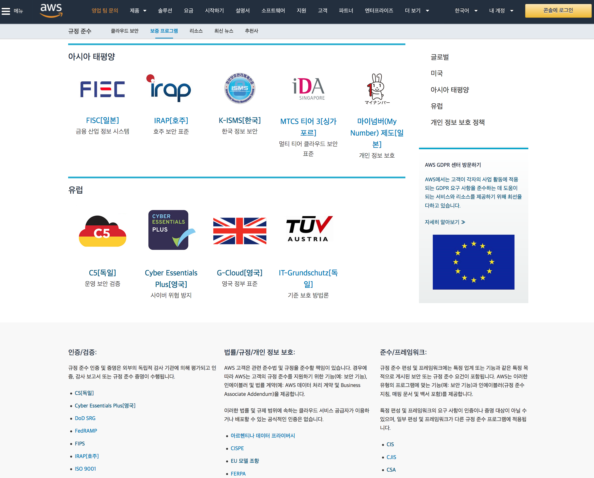
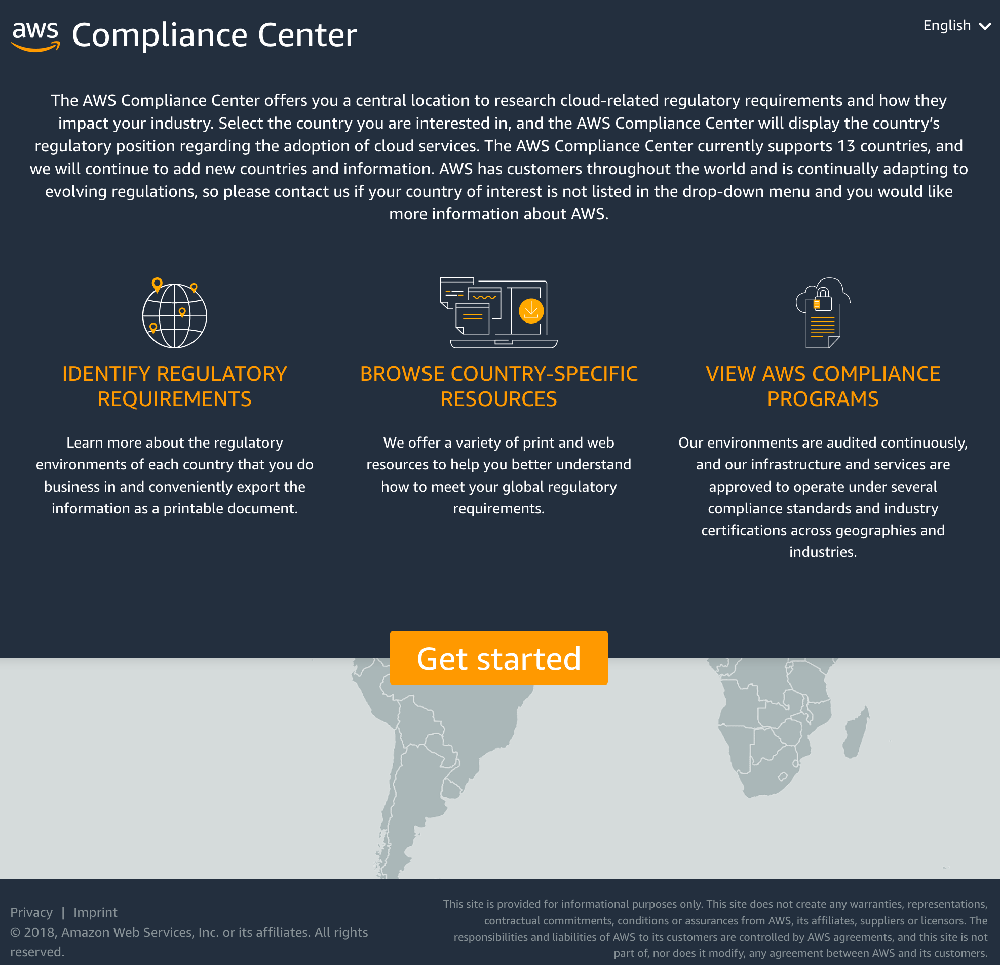
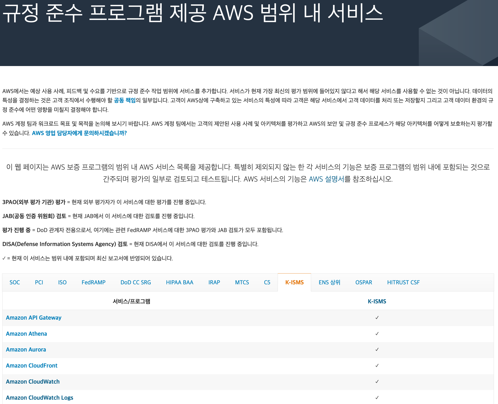
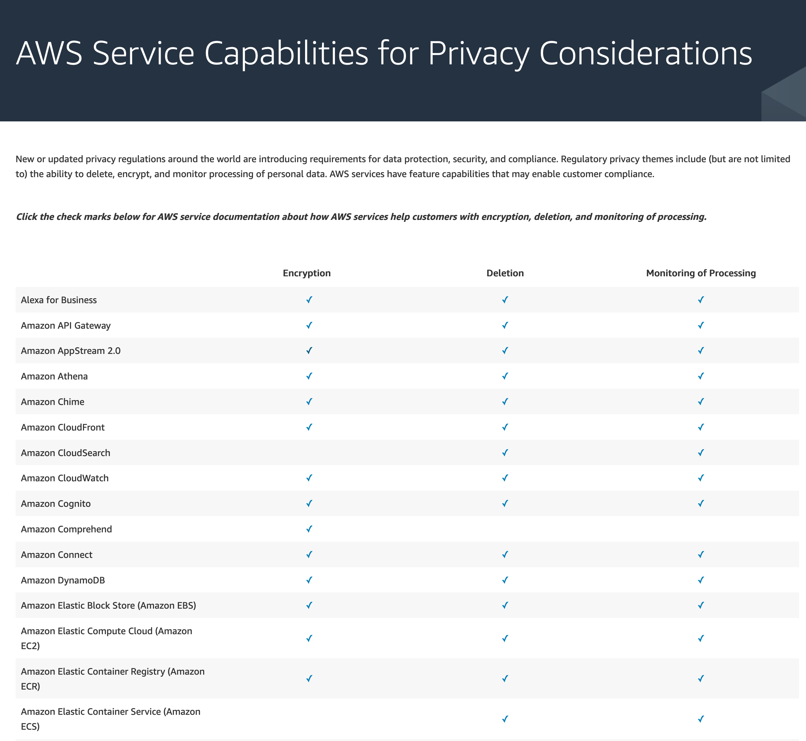
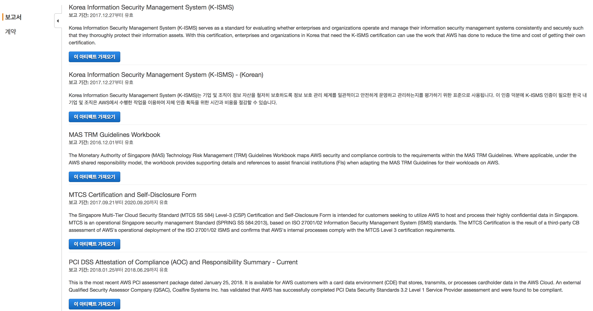

# 컴플라이언스 관련 정보

AWS 클라우드를 이용하는데 있어서, 고객들이 주지해야 될 국내외 규제준수, 컴플라이언스 백서, 온라인 강의, SLA 및 AWS의 각종 정책, 관련 블로그나 동영상 등에 대한 내용을 담고 있는 싸이트들을 안내합니다.

아래 모든 내용은 한국 고객의 편의를 위하여 참고할 수 있는 내용으로, __법적인 효력을 지니지는 않습니다.__ 공식적인 내용은 https://aws.amazon.com/ko/compliance/ 를 참조하십시오.

## AWS 규정준수 프로그램
[AWS 규정 준수 프로그램](https://aws.amazon.com/ko/compliance/programs/) – AWS가 클라우드 사업자로서 획득하거나 준수하고 있는 글로벌과 지역별 규정 준수내역에 대한 자세한 설명을 제공하고 있습니다. 한국의 [K-ISMS](https://aws.amazon.com/ko/compliance/k-isms/)에 대한 내용도 함께 제공됩니다.

## AWS Compliance Center
[AWS Compliance Center](https://www.atlas.aws/) - 미국, 영국, 프랑스, 독일, 이탈리아, 스페인, 스위스, 덴마크, 스웨덴, 호주, 홍콩, 인도, 한국, 싱가폴 등 글로벌 각국의 규제에 대한 AWS 내, 외부 자료들과 정보들을 모아 놓은 싸이트입니다.

## 규정 준수 프로그램 제공 AWS 범위 내 서비스
[규정 준수 프로그램 제공 AWS 범위 내 서비스](https://aws.amazon.com/ko/compliance/services-in-scope/?nc1=h_ls) - K-ISMS를 비롯하여 AWS 각 서비스 별로 글로벌 및 국가별 법규, 규제, 스탠다드 등에 대한 준수/지원 여부를 확인할 수 있는 사이트입니다.

## AWS Service Capabilities for Privacy Considerations
[AWS Service Capabilities for Privacy Considerations](https://aws.amazon.com/compliance/data-privacy/service-capabilities/) – AWS가 제공하는 각종 서비스 별로 개인정보 요건인 암호화, 삭제, 모니터링 관점에서 각각 기능들의 링크들을 정리한 싸이트입니다. 목록에 있는 체크 아이콘을 클릭하면 서비스의 해당 기능 설명 페이지로 이동합니다.

## AWS Artifact
[AWS Artifact](https://aws.amazon.com/ko/artifact/) – AWS 규정 준수 프로그램에서 제공하고 있는 준수 내역 중 엄선된 보고서와 인증서를 AWS 콘솔 상에서 온 디맨드 방식으로 다운로드 할 수 있는 서비스로서, ISO 27001, ISO 27017, ISO 27018, ISO 9001, PCI-DSS, SOC1, SOC2, SOC3, FedRAMP 및 한국의 [K-ISMS](https://aws.amazon.com/ko/compliance/k-isms/)에 대한 인증서도 받아 볼 수 있습니다. 단, 이용을 하기 전에 Artifact NDA와 BAA에 대한 온라인 동의과정이 필요합니다.

## [AWS Audit Manager](https://aws.amazon.com/ko/audit-manager/?nc1=h_ls)

AWS Audit Manager는 AWS 사용량을 지속적으로 감사하여 위험과 규정 및 산업 표준의 준수를 평가하는 방법을 간소화하는 데 도움이 됩니다. Audit Manager는 증거 수집을 자동화하여 감사에 자주 발생하는 "모든 실무 작업"의 수동 작업을 줄이고 비즈니스가 성장함에 따라 클라우드에서 감사 기능을 확장할 수 있습니다. Audit Manager를 사용하면 제어라고도 하는 정책, 절차 및 활동이 효과적으로 작동하는지 쉽게 평가할 수 있습니다. 감사 시간이 되면 AWS Audit Manager를 통해 통제 항목에 대한 이해관계자의 검토를 관리함으로써 수동 작업을 대폭 줄이면서 감사 준비 보고서를 작성할 수 있습니다. Audit Manager를 이용하는데 참고할 만한 유용한 내용들은 아래와 같습니다.

**Bookmark**

* [AWS Audit Manager의 보안](https://docs.aws.amazon.com/ko_kr/audit-manager/latest/userguide/security.html)
* 외부백서 - [Effective compliance and audit management using Amazon Web Services (AWS) Audit Manager](https://www2.deloitte.com/content/dam/Deloitte/us/Documents/risk/us-deloitte-aws-audit-manager-whitepaper-clean.pdf)
* GIT - [Custom Audit Manager Controls and Frameworks](https://github.com/aws-samples/aws-audit-manager-custom-frameworks)
* Blog - [AWS Audit Manager Simplifies Audit Preparation](https://aws.amazon.com/ko/blogs/aws/aws-audit-manager-simplifies-audit-preparation/)
* Blog - [Prepare for Oracle license audits in AWS using AWS Audit Manager and AWS License Manager](https://aws.amazon.com/blogs/mt/prepare-for-oracle-license-audits-in-aws-using-aws-audit-manager-and-aws-license-manager/)
* Blog - [Integrate across the Three Lines Model (Part 1): Build a custom automation of AWS Audit Manager with AWS Security Hub](https://aws.amazon.com/blogs/mt/integrate-across-the-three-lines-model-part-1-build-a-custom-automation-of-aws-audit-manager-with-aws-security-hub/)
* Blog - [Streamlining evidence collection with AWS Audit Manager](https://aws.amazon.com/blogs/security/streamlining-evidence-collection-with-aws-audit-manager/)

## Compliance Quickstarts
주요 컴플라이언스를 준수하는데 참고할 수 있는 모범 보안 아키텍쳐를 안내하고 있는 퀵스타트 링크입니다.

* [AWS의 PCI DSS에 대해 표준화된 아키텍처](https://docs.aws.amazon.com/ko_kr/quickstart/latest/accelerator-pci/welcome.html)
* [PCI DSS and AWS Foundational Security Best Practices on the AWS Cloud](https://aws.amazon.com/ko/quickstart/architecture/compliance-pci-fsbp-remediation/?nc1=h_ls)
* [AWS의 HIPAA에 대해 표준화된 아키텍처](https://docs.aws.amazon.com/ko_kr/quickstart/latest/accelerator-hipaa/welcome.html)
* [AWS 기반 HIPAA 참조 아키텍처](https://aws.amazon.com/ko/quickstart/architecture/compliance-hipaa/?nc1=h_ls)
* [Cohesive Networks VNS3 on AWS](https://aws.amazon.com/ko/quickstart/architecture/cohesive-networks-vns3/) _- VPC상에 VNS3 Overlay 네트워크를 구성하여 HIPAA 암호화 규정 준수를 지원_
* [AWS에서 NIST 기반 보증 프레임워크에 대해 표준화된 아키텍처](https://docs.aws.amazon.com/ko_kr/quickstart/latest/accelerator-nist/welcome.html)
* [AWS에서 NIST 고위험 제어를 위해 표준화된 아키텍처](https://docs.aws.amazon.com/ko_kr/quickstart/latest/accelerator-nist-high-impact/welcome.html)
* [CIS AWS Foundations Benchmark](https://s3.amazonaws.com/quickstart-reference/enterprise-accelerator/cis/benchmark/latest/doc/cis-benchmark-on-the-aws-cloud.pdf)
* [의료용 AWS 기반 Tableau Server](https://aws.amazon.com/ko/quickstart/architecture/tableau-server-healthcare/) _- HIPAA 워크로드 용 BI 솔루션인 Tableau환경 구성_
* [UK-OFFICIAL on AWS용 표준 아카텍처](https://aws.amazon.com/ko/quickstart/architecture/compliance-uk-official/) _- NCSC와 CIS 보안 규정을 준수하는 표준 환경을 구성_
* [IRAP PROTECTED on AWS](https://aws.amazon.com/quickstart/architecture/irap-protected/)
* [Reference Architecture for HITRUST on AWS](https://aws.amazon.com/quickstart/architecture/compliance-hitrust/)
* [ISMS-P on AWS](https://aws.amazon.com/ko/quickstart/architecture/isms-p/?nc1=h_ls) _- K-ISMS-P_
* Blog - [Audit companion for the AWS PCI DSS Quick Start](https://aws.amazon.com/ko/blogs/security/audit-companion-for-the-aws-pci-dss-quick-start/)
* [Fintech Blueprint on the AWS Cloud](https://aws.amazon.com/quickstart/architecture/fintech-blueprint/)
* [AWS 기반 SWIFT Client Connectivity](https://aws.amazon.com/ko/quickstart/architecture/swift-client-connectivity/) _- SWIFT 네트워크 연결을 위한 표준화된 환경_

## 한국 정보보호 관리체계(K-ISMS-P)
K-ISMS-P에 대한 안내 페이지.

* [K-ISMS 인증](https://aws.amazon.com/ko/compliance/k-isms/?nc1=h_ls)
* [KISA K-ISMS-P AWS 서울 리전 인증서 확인 페이지](https://isms.kisa.or.kr/main/ispims/issue/?certificationMode=list&crtfYear=&searchCondition=2&searchKeyword=%EC%95%84%EB%A7%88%EC%A1%B4&__encrypted=U8oaEwTLg12yqNDZuCwRPMiDRLgcrZjlbxomU5uctoZc1kXWONBhXaf0KhG%2BaV6wpp2zSeTry6yKT1QpQPP4n6Wl4JbzPyTKSn7s1FoRr90UnnwTp%2BW928V1TpyMuwFVMU8D270RkIg564CRAF0bUnkvpnfyAxjhbyn0pSpjvw%2BMlXuoQnR3oJUfvVi%2B1dac8Gnd7jHhSmiDLOX09CuWhVRPx40RuMcaT%2FHbItyyZvQECWvcAvRb36C1zB%2FnwnWRJNfv74iaCKBgpNE%2BERnypNyBfcqQSKf%2BfDsW9aHcpTOO1K747YgBrg%3D%3D)
* [규정 준수 프로그램 제공 AWS 범위 내 서비스](https://aws.amazon.com/ko/compliance/services-in-scope/)
* [Operational Best Practices for K-ISMS](https://docs.aws.amazon.com/ko_kr/config/latest/developerguide/operational-best-practices-for-k-isms.html)
* Blog - [AWS is the first global cloud service provider to comply with the new K-ISMS-P standard](https://aws.amazon.com/ko/blogs/security/aws-is-the-first-global-cloud-service-provider-to-comply-with-the-new-k-isms-p-standard/)

## EU GDPR
2018년 5월 25일 시행되는 EU GDPR 관련 정보를 제공하는 주요 링크들입니다.

* [AWS GDPR 센터](https://aws.amazon.com/ko/compliance/gdpr-center/?nc1=h_ls)_- GDPR에 대한 상세 내용을 담고 있는 백서, FaQ, AWS가 지원하는 부분 등에 대한 안내_
* [정부 GDPR 안내센터](https://www.privacy.go.kr/gdpr)_- 정부가 GDPR에 대한 상세 내용을 안내하고 있는 싸이트로서, GDPR 한글 번역본과, 행안부와 KISA에서 발간한 우리 나라 기업을 위한 1차 가이드라인 등을 제공_
* [AWS GDPR Data Processing Addendum](https://d1.awsstatic.com/legal/aws-gdpr/AWS_GDPR_DPA.pdf) _- AWS 서비스 약관에 포함된 AWS GDPR DPA 본문(2018년 5월 25일 발효)_
* [SUPPLEMENTARY ADDENDUM TO AWS GDPR DATA PROCESSING ADDENDUM](https://d1.awsstatic.com/Supplementary_Addendum_to_the_AWS_GDPR_DPA.pdf)
* [프라이버시 고려 사항에 대한 AWS 서비스 기능](https://aws.amazon.com/ko/compliance/data-privacy/service-capabilities/)
* [Brexit 및 AWS에 대해 알아야할 모든 것](https://aws.amazon.com/ko/compliance/gdpr-center/brexit/)
* 백서 - [Navigating GDPR
Compliance on AWS](https://docs.aws.amazon.com/ko_kr/whitepapers/latest/navigating-gdpr-compliance/navigating-gdpr-compliance.pdf#general-data-protection-regulation-overview)
* Blog - [All AWS Services GDPR ready](https://aws.amazon.com/ko/blogs/security/all-aws-services-gdpr-ready/)
* Blog - [AWS GDPR Data Processing Addendum – Now Part of Service Terms](https://aws.amazon.com/ko/blogs/security/aws-gdpr-data-processing-addendum/)
* Blog - [Handling data erasure requests in your data lake with Amazon S3 Find and Forget](https://aws.amazon.com/blogs/big-data/handling-data-erasure-requests-in-your-data-lake-with-amazon-s3-find-and-forget/)
* Blog - [AWS and EU data transfers: strengthened commitments to protect customer data](https://aws.amazon.com/blogs/security/aws-and-eu-data-transfers-strengthened-commitments-to-protect-customer-data/)
* Blog - [New Standard Contractual Clauses now part of the AWS GDPR Data Processing Addendum for customers](https://aws.amazon.com/ko/blogs/security/new-standard-contractual-clauses-now-part-of-the-aws-gdpr-data-processing-addendum-for-customers/)
* Blog - [How UK public sector customers can implement NCSC security principles to protect data transfers to AWS](https://aws.amazon.com/ko/blogs/publicsector/how-uk-public-sector-customers-can-implement-ncsc-security-principles-to-protect-data-transfers-to-aws/)

## 기타 도움될 만한 링크

* [AWS 이용계약](https://aws.amazon.com/ko/agreement/)
* [AWS 서비스 약관](https://aws.amazon.com/ko/service-terms/)
* [AWS 사이트 약관](https://aws.amazon.com/ko/terms/)
* [AWS 개인정보 처리방침](https://aws.amazon.com/ko/privacy/)
* [데이터 프라이버시](https://aws.amazon.com/ko/compliance/data-privacy-faq/?nc1=h_ls) _- 고객 데이터에 대한 최종적인 소유권과 통제, 그리고 AWS가 이 부분에서 개입하는 역할에 대한 잘 정리된 싸이트_
* [AWS 이용목적 제한방침](https://aws.amazon.com/ko/aup/)
* [Amazon 정보 요청](https://aws.amazon.com/ko/compliance/amazon-information-requests/) _- AWS가 법적 구속력을 갖춘 정보 요청에 대한 지원 건수를 반기별로 집계하여 공개하는 싸이트_
* [하위 프로세서 및 계열 운영 엔터티](https://aws.amazon.com/ko/compliance/sub-processors/)
* [AWS 외주업체 액세스](https://aws.amazon.com/ko/compliance/third-party-access/) _- 고객이 AWS에 업로드한 개인 데이터에 액세스할 수 있도록 AWS가 승인하는 외주업체 목록_
* [AWS Service Level Agreements](https://aws.amazon.com/legal/service-level-agreements/?nc1=h_ls) _- AWS가 SLA기준을 제공하는 서비스들에 대한 안내_
* [HIPAA Eligible Services Reference](https://aws.amazon.com/compliance/hipaa-eligible-services-reference/) _- HIPAA Eligible한 AWS 서비스 목록(2019. Jan. 24일 기준)_
* [PCI - Penetration Testing Guidance](https://www.pcisecuritystandards.org/documents/Penetration-Testing-Guidance-v1_1.pdf?agreement=true&time=1561081733779) _- v.1.1, 2017년 9월_
* 동영상 [AWS Summit Seoul 2018] - [비즈니스 혁신 가속화와 효과적 규정 준수를 위한 AWS ISMS 소개](https://youtu.be/TJRY3hB6Ldk)
* [California Consumer Privacy Act (CCPA)](https://aws.amazon.com/compliance/california-consumer-privacy-act/)
* [외부 링크 - 데이터 3법](http://www.korea.kr/special/policyCurationView.do?newsId=148867915) _- 2020년 1월 9일 국회 통과된 데이터 3법 개정안에 대한 종합적인 안내_
* Compliance 전문 파트너 - [SAK(한국 정보 보호 인식)](https://www.securitya.kr/%ed%81%b4%eb%9d%bc%ec%9a%b0%eb%93%9c-%eb%b3%b4%ec%95%88/) _- K-ISMS-P, GDPR, CSP 안전성평가 등 지원_ 
* Blog - [AWS and EU data transfers: strengthened commitments to protect customer data](https://aws.amazon.com/blogs/security/aws-and-eu-data-transfers-strengthened-commitments-to-protect-customer-data/)
* Blog - [AWS achieves ISO/IEC 27701:2019 certification](https://aws.amazon.com/ko/blogs/security/aws-achieves-iso-iec-27701-2019-certification/)
* Blog - [17 additional AWS services authorized for DoD workloads in the AWS GovCloud Regions](https://aws.amazon.com/ko/blogs/security/17-additional-aws-services-authorized-for-dod-workloads-in-the-aws-govcloud-regions/)
* Blog - [Optimizing cloud governance on AWS: Integrating the NIST Cybersecurity Framework, AWS Cloud Adoption Framework, and AWS Well-Architected](https://aws.amazon.com/ko/blogs/security/optimizing-cloud-governance-on-aws-integrating-the-nist-cybersecurity-framework-aws-cloud-adoption-framework-and-aws-well-architected/)
* Blog - [AWS achieves GSMA security certification for US East (Ohio) Region](https://aws.amazon.com/blogs/security/aws-achieves-gsma-security-certification-for-us-east-ohio-region/)
* Blog - [137 AWS services achieve HITRUST certification](https://aws.amazon.com/blogs/security/137-aws-services-achieve-hitrust-certification/)
* Blog - [New AWS workbook for New Zealand financial services customers](https://aws.amazon.com/ko/blogs/security/new-aws-workbook-for-new-zealand-financial-services-customers/)
* Blog - [AWS attained MTCS Level 3 certification under the new SS584:2020 standard](https://aws.amazon.com/ko/blogs/security/aws-attained-mtcs-level-3-certification-under-the-new-ss5842020-standard/)
* Blog - [Why and how customers achieve FIPS-Compliance for .NET Workloads on AWS](https://aws.amazon.com/ko/blogs/modernizing-with-aws/why-and-how-customers-achieve-fips-compliance-for-net-workloads-on-aws/)
* Blog - [Healthcare Transparency in Coverage Rule (TCR) – Cost-effectively Hosting Machine-Readable Files On AWS](https://aws.amazon.com/ko/blogs/industries/healthcare-transparency-in-coverage-rule-tcr-cost-effectively-hosting-machine-readable-files-on-aws/)
* Blog - [HIPAA and HITRUST on AWS](https://aws.amazon.com/ko/blogs/apn/hipaa-and-hitrust-on-aws/)
* Blog - [Automating the Installation Qualification (IQ) Step to Expedite GxP Compliance](https://aws.amazon.com/ko/blogs/industries/automating-the-installation-qualification-iq-step-to-expedite-gxp-compliance/)
* Blog - [AWS GDPR Data Processing Addendum – Now Part of Service Terms](https://aws.amazon.com/ko/blogs/security/aws-gdpr-data-processing-addendum/)
* Blog - [Addressing Data Residency with AWS](https://aws.amazon.com/ko/blogs/security/addressing-data-residency-with-aws/)
* Blog - [Applying the AWS Shared Responsibility Model to your GxP Solution](https://aws.amazon.com/ko/blogs/industries/applying-the-aws-shared-responsibility-model-to-your-gxp-solution/)
* Blog - [Improving Healthcare Education and Simulation with AWS](https://aws.amazon.com/blogs/industries/improving-healthcare-education-and-simulation-with-aws/)
* Blog - [Building a foundation for GxP regulated IoT workloads on AWS](https://aws.amazon.com/blogs/industries/building-a-foundation-for-gxp-regulated-iot-workloads-on-aws/)
* Blog - [AWS HITRUST Shared Responsibility Matrix version 1.2 now available](https://aws.amazon.com/blogs/security/aws-hitrust-shared-responsibility-matrix-version-1-2-now-available/)
* Blog - [AWS and the UK rules on operational resilience and outsourcing](https://aws.amazon.com/blogs/security/aws-and-the-uk-rules-on-operational-resilience-and-outsourcing/)
* Blog - [AWS HITRUST Inheritance: What customers should know](https://aws.amazon.com/blogs/security/aws-hitrust-csf-certification-is-available-for-customer-inheritance/)
* Blog - [Change Management for Life Sciences](https://aws.amazon.com/blogs/mt/change-management-for-life-sciences/)
* Blog - [GxP Continuous Compliance on AWS](https://aws.amazon.com/blogs/industries/gxp-continuous-compliance-on-aws/)

## Remarks

* 이 사이트의 모든 내용은 바뀌거나 수정될 수 있습니다.
* 위 모든 내용은 한국 고객의 편의를 위하여 참고할 수 있는 내용으로, 법적인 효력을 지니지는 않습니다. 공식적인 내용은 https://aws.amazon.com/ko/compliance/ 를 참조하십시오. 
* 제공되는 내용에 이견이 있거나 잘못된 링크를 발견하시면, 관리자(gisunlim@amazon.com)에게 메일을 주시면 대단히 감사하겠습니다.

---

[개인 정보 보호 정책](https://aws.amazon.com/privacy/?nc1=f_pr) | [사이트 이용 약관](https://aws.amazon.com/terms/?nc1=f_pr) | © 2020, Amazon Web Services, Inc. 또는 자회사. All rights reserved. 

