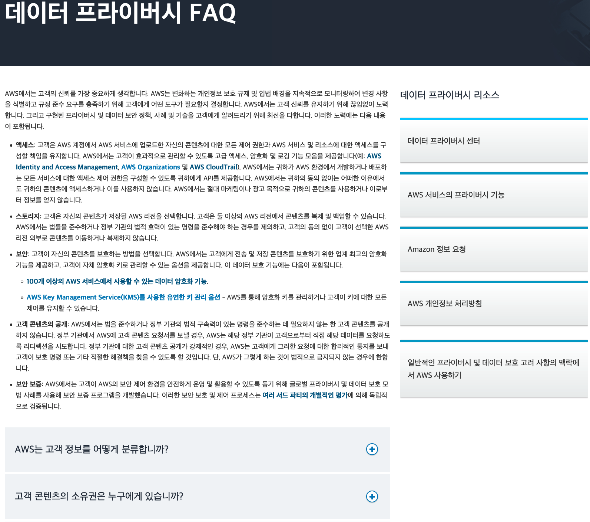

# 주요 질문 및 답변

## 데이터 프라이버시 FAQ

* [데이터 프라이버시 FAQ](https://aws.amazon.com/ko/compliance/data-privacy-faq/) _- AWS는 고객의 신뢰를 가장 중요하게 생각하며, 변화하는 개인정보 보호 규제 및 입법 배경을 지속적으로 모니터링하여 변경 사항을 식별하고 규정 준수 요구를 충족하기 위해 고객에게 어떤 도구가 필요할지 결정합니다. 또한 AWS는 고객 신뢰를 유지하기 위해 끊임없이 노력하며, 구현된 프라이버시 및 데이터 보안 정책, 사례 및 기술을 고객에게 알려드리기 위해 최선을 다합니다. 이 사이트에서는 이러한 노력에 대한 다양한 안내를 제공하고 있습니다._

## 기타 규정준수 관련 FAQ

AWS 클라우드를 이용하는데 있어서, 고객들이 주로 질문하는 주요 컴플라이언스 요건들에 대해 AWS 보안 및 컴플라이언스 백서, 제 3자 감사 리포트, AWS 공식 문서 등에서 관련 내용을 발췌하여 안내합니다.

아래 모든 내용은 한국 고객의 편의를 위하여 참고할 수 있는 내용으로, __법적인 효력을 지니지는 않습니다.__ 공식적인 내용은 https://aws.amazon.com/ko/compliance/ 를 참조하십시오.

* __AWS는 보안 및 프라이버시에 대해 어떤 인증을 제공하나요?__

_AWS는 다수의 국제적인 인증과 인가를 획득해 ISO27001, ISO27071(클라우드 보안), ISO 27018 (개인 정보 보호)와 주로 의료, 생명 과학, 의학 장비, 자동차, 항공 부문에 대한 ISO 9001 과 같은 제3자 보증 프레임워크에 부합함을 증명합니다. 글로벌 버티컬 분야의 경우, AWS PCI, SOC 1, 2, 3 인증은 고객들이 전반적인 신용카드 지불 및 회계 감사 프레임워크 프로그램을 사용할 수 있게 해 줍니다._

* __AWS가 취득한 ISO27001, SOC1/2, ISMS 등의 인증서는 어떻게 받을 수 있나요?__

_고객이 직접 AWS Artifact를 통해 받아보실 수 있습니다. - [AWS Artifact 시작하기](https://aws.amazon.com/ko/artifact/getting-started/?nc1=h_ls) 페이지(로그인 필요)에 상세한 설명이 되어 있습니다._

* __AWS가 취득한 ISO 27001, SOC, K-ISMS와 같은 국내외 인증 프로그램의 최신 목록은 어디에서 구할 수 있나요?__

_[클라우드 규정 준수](https://aws.amazon.com/ko/compliance/programs/) 웹페이지에서 현재 유효한 취득 인증 프로그램 목록을 확인하실 수 있습니다. 또는 [AWS Artifact](https://aws.amazon.com/ko/artifact/getting-started/?nc1=h_ls)에서도 AWS가 획득한 인증 프로그램 목록을 확인하실 수 있습니다._

* __지금 이용하고 있는 또는 AWS로 이관하려고 하는 워크로드에 개인정보가 있는지 확인해 줄 수 있나요?__

_책임공유모델에 따라 AWS는 이 문제에 관해 고객에게 어떠한 법적 조언을 제공할 수 없으며, 고객이 직접 법률기관 등을 통해 확인하셔야 보다 더 정확한 답변을 얻을 수 있습니다. 일반적으로는 '처리하는 자'의 입장에서 개인을 알아볼 수 있는 모든 정보가 개인정보가 될 수 있습니다. 예를 들어, 정보주체와 관련되어 있으면 키, 나이, 몸무게 등 ‘객관적 사실’에 관한 정보나 그 사람에 대한 제 3자의 의견 등 ‘주관적 평가’ 정보 모두 개인정보가 될 수 있습니다. 그러므로, 정확한 판단을 위해 직접 공신력있는 법률기관을 통해 확인하시는 것이 안전합니다.- [개인정보보호 종합포털의 개인정보 보호법 해설서](https://www.privacy.go.kr/nns/ntc/selectBoardArticle.do?nttId=7603&bbsId=BBSMSTR_000000000001&bbsTyCode=BBST03&bbsAttrbCode=BBSA03&authFlag=Y&pageIndex=1&searchCnd=&searchWrd=&replyLc=0&nttSj=%EA%B0%9C%EC%9D%B8%EC%A0%95%EB%B3%B4%20%EB%B3%B4%ED%98%B8%EB%B2%95%20%ED%95%B4%EC%84%A4%EC%84%9C) 10쪽 참조_

	관련 법규: 정보통신망 이용촉진 및 정보보호 등에 관한 법률 (정보통신망법) 제2조 (정의) 6.
	"개인정보"란 생존하는 개인에 관한 정보로서 성명·주민등록번호 등에 의하여 특정한 개인을 알아볼 수 있는 부호·문자·음성·음향 및 영상 등의 정보(해당 정보만으로는 특정 개인을 알아볼 수 없어도 다른 정보와 쉽게 결합하여 알아볼 수 있는 경우에는 그 정보를 포함한다)를 말한다.

* __AWS 내부 직원에 의한 고객 정보 탈취 우려가 없음을 공식적으로 입증할 수 있는가요?__

_AWS 내부 직원에 대한 통제는 독립적인 감사기관에 의해 1년에 2번 주기적으로 평가되는 SOC1 보고서를 통해 확인 가능합니다. AWS 백서 ['Amazon Web Services Risk and Compliance'](https://d0.awsstatic.com/International/ko_KR/whitepapers/AWS_Risk_Compliance_Whitepaper_Aug_2015.pdf)의 17 page에 다음 문구(Ref 12) 참조하시기 바랍니다._

	Q :내부자 액세스. 클라우드 공급자가 고객 데이터 및 애플리케이션에 대한 부적절한 내부자 액세스 위협을 해결합니까?
	A : AWS는 부적절한 내부자 액세스 위협을 해결하는 특정 SOC 1 컨트롤을 제공하며, 이 문서에 포함된 공개 인증 및 규정 준수 프로그램이 내부자 액세스를 해결합니다. 모든 인증 및 제3자 증명은 논리적 액세스와 관련한 사전적 및 사후적 컨트롤을 평가합니다. 또한 정기적인 위험 평가를 통해 내부자 액세스가 어떻게 제어 및 모니터링되고 있는지 집중적으로 검토합니다.

* __AWS를 이용하게 되면, 저희 고객들의 정보들이 저장되게 됩니다. 개인 민감정보들의 암호화는 어떻게 진행되며, 별도의 파기 및 백업 절차가 존재하나요?__

_AWS 상에서의 최종 고객 (end customer)의 정보의 경우 AWS를 이용하는 고객사에서 직접 암호화를 진행하도록 되어 있습니다. 다만, AWS 상에서 암호화를 진행하실 수 있도록 다양한 서비스를 제공하고 있으며 (AWS KMS, S3 및 EBS encryption, in-transit encryption 등), 추가로 필요한 경우 3rd party 암호화 solution을 사용해서 암호화 진행이 가능합니다. 데이터 삭제 및 백업의 경우에도 AWS가 임의로 삭제나 백업을 진행하지는 않고 있으며 고객사에서 직접 데이터 백업이나 삭제가 가능하고 이러한 기능들을 AWS 서비스 기능으로 제공하고 있습니다. 사용이 완료된 하드웨어 (스토리지)의 파기는 DoD 5220.22-M (“National Industrial Security Program Operating Manual“) or NIST 800 -88 (“Guidelines for Media Sanitization”) 표준에 따라 파기 절차를 진행하고 있습니다. 모든 마그네틱 스토리지들은디가우징이 진행되며 물리적으로 파쇄되어 산업 표준 방식에 따라서 처리됩니다._

* __고객 입장에서 삭제된 데이터가 완전히 지워 졌음을 확인 할 수 있는가요?__

_AWS의 인프라, 거버넌스 및 운영 환경은 DoD(미국방부)와 NIST(미연방정보 보안시스템) 인증을 준수하고 있으며, DOD 5220.22-M(“미국방부 산업 보안 프로그램 운영 매뉴얼”)과 NIST 800-88(“미연방정부 미디어 삭제 가이드ㄹ인”)에 의겨하여 물리적 장비는 폐기 됩니다. 모든 폐기된 마그네틱 스토리지 디바이스는 업계 표준에 따라서 자기(Magnetic) 소거되고 물리적으로 파쇄됩니다. 또한, 스토리지 데이터 파기 절차에 관하 인증 및 감사(Audit)는 PCI 3.2, ISO27001, HIPAA, SOC1, SOC2를 준수합니다. 자세한 내용은 AWS백서 [AWS Security Whitepaper](https://d0.awsstatic.com/International/ko_KR/whitepapers/AWS_Security_Whitepaper_Overview.pdf)의 8 page 하단 Storage Device Decommissioning 파트를 참조하시기 바랍니다. 또한, 고객 선택사항으로 고객이 자체 생성한 암호화키로 자원을 암호화하고 삭제처리한 뒤, 키를 영구 삭제하여 완전삭제 처리할 수 있고, 필요하다면, 별도로 파트너가 제공하는 Wiping 솔루션 적용 가능 - [Secured Ultra Defrag](https://aws.amazon.com/marketplace/pp/B01MFDTGES?qid=1484280740369&sr=0-12&ref_=srh_res_product_title)_

	** 스토리지 디바이스 폐기 ** 
	
	스토리지 디바이스의 수명이 다했을 경우 권한이 없는 개인에게 고객 데이터가 노출되는 것을 방지하기 위해 고안된 폐기 프로세스가 AWS 내에 마련되어 있습니다. AWS는 DoD 5220.22-M("국가 산업 보안 프로그램 운영 매뉴얼") 또는 NIST 800-88("미디어 삭제 가이드라인")에서 설명하는 기술을 사용해 폐기 프로세스에 따라 데이터를 제거합니다. 모든 폐기된 마그네틱 스토리지 디바이스는 업계 표준 관행에 따라서 자기 소거되고 물리적으로 파쇄됩니다.

* __AWS 상의 모든 이벤트 로그들에 대한 무결성을 고객이 직접 확인 할 방법이 있는가요?__

_CloudTrail 로그에 대한 무결성을 검증할 수 있는 [로그 파일 무결성 검증](http://docs.aws.amazon.com/ko_kr/awscloudtrail/latest/userguide/cloudtrail-log-file-validation-intro.html)기능이 제공됩니다._

* __AWS 는 퍼블릭 클라우드라 CPU, 캐쉬 등도 공유해서 사용하는 구조인데, 우리 정보를 다른 고객들이 접근 못한다는 보장이 없지 않나요?__

_AWS 백서 ['Amazon Web Services Risk and Compliance'](https://d0.awsstatic.com/International/ko_KR/whitepapers/AWS_Risk_Compliance_Whitepaper_Aug_2015.pdf) 의 17 page에 다음 문구(Ref 13, Ref 18) 참조하시기 바랍니다._

	Q: 다중 테넌트. 고객 분리가 안전하게 구현되었습니까?
	A: AWS 환경은 가상화된 다중 테넌트 환경입니다. AWS는 보안 관리 프로세스, PCI 컨트롤, 각 고객을 다른 고객과 격리할 수 있도록 고안된 기타 보안 컨트롤을 구현했습니다. AWS 시스템은 고객이 가상화 소프트웨어를 통한 필터링으로 자신에게 할당되지 않은 물리적 호스트 또는 인스턴스에 액세스하는 것을 차단할 수 있도록 설계되었습니다. 이 아키텍처는 독립적인 PCI QSA(Qualified Security Assessor)의 검증을 받았으며 2015년 4월에 발표된 PCI DSS 버전 3.1의 모든 요구 사항을 준수하는 것으로 확인되었습니다. AWS는 단일 테넌시 옵션도 제공합니다. 전용 인스턴스는 단일 고객에게 배정된 하드웨어를 실행하는 Amazon Virtual Private Cloud(Amazon VPC) 내에서 시작되는 Amazon EC2 인스턴스입니다. 전용 인스턴스를 통해 Amazon VPC와 AWS 클라우드의 이점을 최대한 활용하는 동시에 Amazon EC2 컴퓨터 인스턴스를 하드웨어 수준에서 격리할 수 있습니다.

	Q : 데이터 격리. 클라우드 공급자가 고객 데이터를 적절하게 격리합니까?
	A : 고객을 대신해 AWS에 저장된 모든 데이터는 강력한 테넌트 격리 보안 및 제어 기능을 갖고 있습니다. Amazon S3는 고급 데이터 액세스 제어를 제공합니다. 특정 데이터 서비스 보안에 대한 자세한 내용은 AWS 보안 백서를 참조하십시오. 특정 데이터 서비스 보안에 대한 자세한 내용은 AWS 보안 백서를 참조하십시오. 

_추가하여 [SOC3 report](https://d0.awsstatic.com/whitepapers/compliance/soc3_amazon_web_services.pdf)의 다음 문구도 참조하시기 바랍니다.(14 페이지)_

	AWS 시스템은 가상화 소프트웨어를 통해 필터링 함으로써 고객이 본인 소유가 아닌 물리서버 혹은 인스턴스에 접근하는 것을 방지하도록 설계되어 있습니다. 

* __AWS 의 퍼실리티나 인프라 보안이 잘 되고 있는지 고객이 확인하거나 데이터 센터의 위치를 알려줄 수 있나요?__

_AWS의 데이터 센터는 여러 고객이 사용합니다. 고객의 데이터 센터를 실사하는 것을 허용하지 않습니다 (제3자에게 데이터 센터를 노출시키는 격이기 때문). 대신 독립적이고 권한이 있는 감사 기관이 수행한 AWS의 SOC 1 Type 2 보고서를 통해 적절한 통제 프로세스가 있고 잘 적용되고 있음을 확인할 수 있습니다(NDA필요). 그 외에도, 데이터 센터의 물리적인 보안에 대한 독립적이고 권한이 있는 감사자에 의한 또 다른 감사 결과는 [보안문의하기, AWS Artifact](https://pages.awscloud.com/compliance-contact-us.html?Languages=Korean)을 통해 신청할 수 있습니다. (ISO 27001, PCI DSS 등)._

_AWS 백서 ['Amazon Web Services Risk and Compliance'](https://d0.awsstatic.com/International/ko_KR/whitepapers/AWS_Risk_Compliance_Whitepaper_Aug_2015.pdf) 의 15 page에 다음 문구(Ref 9)를 참조하시기 바랍니다._

	Q : 데이터 센터 둘러보기. 클라우드 공급자가 고객이 데이터 센터를 둘러볼 수 있도록 허용합니까?
	A : 아닙니다. AWS 데이터 센터에서는 다양한 고객을 호스팅하기 때문에 고객의 데이터 센터 관람을 허용하지 않습니다. 불특정 다수의 고객이 타사 데이터에 물리적으로 접근할 우려가 있기 때문입니다. 이러한 고객의 요구를 충족하기 위해 독립적이고 역량 있는 감사자가 SOC 1 Type II 보고서의 일부로 규제 항목의 현재 상태와 운영을 검증합니다. 널리 사용되는 이 제3자 검증을 통해 고객은 배포된 컨트롤의 효과를 독립적인 관점으로 바라볼 수 있습니다. AWS와 비밀 유지 계약을 체결한 AWS 고객은 SOC 1 Type II 보고서의 사본을 요청할 수 있습니다. 데이터 센터의 물리적 보안에 대한 개별 평가는 ISO 27001 감사, PCI 평가, ITAR 감사 및 FedRAMP 테스트 프로그램에도 포함되어 있습니다. SOC 1 Type II의 보고서 사본은 위 문의 사항의 AWS Artifact에서 신철할 수 있습니다.

* __우리가 가지고 있는 IDC 기준은 내부 온도 18 도, 상면 무게 800KG 등의 규정이 있습니다. AWS는 이런 고객의 IDC 기준을 맞춰 줄 수 있는가요?__

_IDC 시설 관련한 내용은 담당하는 극소수의 직원만 취급합니다. 이 것은 AWS의 지적자산과 관련이 있으므로, 시설과 관련된 어떤 내용도 전달할 수 없습니다. 그리고 고객의 기준에 맞춰 준다는 보장도 불가합니다. 전세계 수많은 고객들이 이용하는 상황에서 특정 고객의 기준으로 맞출 수는 없지만, 거꾸로 생각하면 그 많은 고객들이 사용하는데 전혀 문제 없는 수준이라는 것을 입증하는 것이라고 볼 수 있습니다. AWS백서 [AWS Security Whitepaper](https://d0.awsstatic.com/International/ko_KR/whitepapers/AWS_Security_Whitepaper_Overview.pdf)의 7 page의 물리적 및 환경적 보안 부분을 참조하시기 바랍니다._

	** 화재감지 및 진압 **
	
	위험을 줄이기 위해 자동 화재 감지 및 소화 장비가 설치되었습니다. 화재 감지 시스템은 모든 데이터 센터 환경, 기계 및 전기장비실, 냉각실 및 발전기 장비실에서 연기감지 센서를 활용합니다.이 구역은 습식 파이프,이중 연동 준비 작동식 시스템 또는 기체 스프링클러 시스템으로 보호됩니다.

	** 전력 **
	
	데이터 센터 전력 시스템은 전이중 방식으로 설계 및 유지관리되도록 설계되어 운영에 전혀 영향을 미치지 않고 365일 항시 사용 가능합니다. 무정전 전원 공급 장치(UPS)는 시설의 중요하고 필수적인 부하에 전력 공급 장애가 발생할 경우에 대비해 백업 전력을 제공합니다. 데이터 센터는 발전기를 사용하여 전체 시설에 백업 전력을 제공합니다.

	** 기후 및 온도 **
	
	기후 제어는 서버 및 기타 하드웨어의 운영 온도를 일정하게 유지하는 데 필요하며, 이는 과열을 방지하고 서비스 중단 가능성을 줄입니다. 데이터 센터는 최상의 대기 상태 조건을 유지하도록 되어 있습니다. 인력 및 시스템은 적절한 수준의 온도와 습도를 모니터링 및 제어합니다.

* __클라우드 환경에서 ISMS (정보보호 관리체계 인증) 획득에 대한 문의가 있습니다. 어떻게 해야하나요?__

_Amazon Web Services(AWS)는 **한국 정보보호관리체계** 인증을 획득한 첫 번째 글로벌 클라우드 서비스 공급업체입니다. 이 인증은 한국 내 기업 및 조직이 보다 효과적으로 규정 준수 요건을 충족하고 고도로 안전하고 안정적인 AWS 클라우드를 통해 제공되는 동급 최고 기술을 사용하여 비즈니스 혁신을 가속화하는 데 도움이 됩니다._

_**[한국 정보보호관리체계(K-ISMS)](https://isms.kisa.or.kr/main/)**는 한국 정부가 도입한 인증 체계로, **[한국인터넷진흥원(KISA)](https://www.kisa.or.kr/eng/main.jsp)** 및 **[한국 과학기술정보통신부(MSIT)](http://english.msit.go.kr/english/main/main.do)**에서 주관합니다.
K-ISMS는 2002년 정보통신망 이용촉진 및 정보보호 등에 관한 법률 제47조(ISMS 인증)에 의거하여 한국 내 법적 요건을 충족하고 ICT 환경을 지원하기 위해 도입되었습니다. K-ISMS는 기업 및 조직이 정보 자산을 철저히 보호하도록 정보 보호 관리 체계를 일관적이고 안전하게 운영하고 관리하는지를 평가하기 위한 표준으로 사용됩니다._

_이 인증 덕분에 K-ISMS 인증이 필요한 한국 내 기업 및 조직은 AWS에서 수행한 작업을 이용하여 자체 인증 획득을 위한 시간과 비용을 절감할 수 있습니다. K-ISMS 인증을 위한 AWS 범위 내 서비스는 **[규정 준수 프로그램 제공 AWS 범위 내 서비스](https://aws.amazon.com/ko/compliance/services-in-scope/)**에서 확인할 수 있습니다._

* __AWS는 외주업체가 있나요?__

_Amazon은 외주업체가 AWS에서 개인 정보가 저장된 데이터를 포함해 고객이 AWS에 업로드한 개인 데이터에 액세스하는 경우에는 사전에 고객에게 알려드립니다. 고객이 AWS에 업로드한 개인 데이터에 액세스할 수 있도록 AWS가 승인하는 외주업체는 다음 [웹사이트](https://aws.amazon.com/ko/compliance/third-party-access/)에 최소 30일 이전에 고지하여 고객에게 알려드립니다._

* __AWS 는 클라우드 컴퓨팅 발전및 이용자 보호에 관한 법률에 대하여 어떠한 노력을 하고 있나요?__

_미국 회사인 AWS Inc. 는 AWS 서비스를 제공하고, 국제적으로 통용되는 인증 (Certification) 및 인정 (Accreditation)을 획득함으로써 제 3자 보증 프레임워크와 부합됨을 증명하였는데 여기에는 ISO 27001 SOC 1, 2, 3, PCI-DSS 및 다수가 포함되어 있습니다. 책임 공유 모델 하에서, AWS는 기반 클라우드 환경의 보안 관리를 담당합니다. AWS의 클라우드 기반 구조는 현존하는 가장 유연하고 안전한 클라우드 컴퓨팅 환경 중 하나로 설계되었으며, 완벽한 고객 분리와 함께 최적의 가용성을 제공합니다._

	** 이용자 보호 **
	
	고객은 서비스를 사용할 때 몇 가지 옵션을 사용하여 자신들의 데이터를 암호화할 수 있는데, AWS의 암호화 기능(KMS), 고객 자신의 키를 사용, 혹은 Third Party 솔루션의 암호화 기법을 활용할 수 있습니다. AWS는 법적인 필요에 응하거나 고객이 선택한 서비스를 해당 고객 및 그 고객의 최종사용자에게 제공하기 위한 목적 이외에는 고객의 컨텐츠에 접근하지 않습니다. AWS는 마케팅이나 광고와 같은 목적을 위해 고객의 데이터를 사용하거나 이로부터 정보를 생성하지도 않습니다.
[클라우드컴퓨팅 발전 및 이용자 보호에 관한 법률 제 27조](https://improvement-ninjas.amazon.com/s3files/s3get.cgi/%26%2349828%3B%26%2353356%3B%26%2347536%3B%26%2349399%3B%202016-01-08%20%26%2350724%3B%26%2354980%3B%205.41.25.png) 참조

	** 고객 데이터 위치 **
	
	AWS는 고객이 지리적으로 특정위치에 데이터를 저장하도록 리전(Region) 을 선택할 수 있습니다. AWS는 법적으로 필요한 상황을 제외하고 고객의 데이터를 옮기지 않습니다.

[클라우드컴퓨팅 발전 및 이용자 보호에 관한 법률 제 26조](https://improvement-ninjas.amazon.com/s3files/s3get.cgi/%26%2349828%3B%26%2353356%3B%26%2347536%3B%26%2349399%3B%202016-01-08%20%26%2350724%3B%26%2354980%3B%202.09.10.png) 참조

	** 고객 데이터 삭제 **
	
	스토리지 디바이스의 수명이 다했을 경우 권한이 없는 개인에게 고객 데이터가 노출되는 것을 방지하기 위해 고안된 폐기 프로세스가 AWS 내에 마련되어 있습니다. AWS는 DoD 5220.22-M("국가 산업 보안 프로그램 운영 매뉴얼") 또는 NIST 800-88("미디어 삭제 가이드라인")에서 설명하는 기술을 사용해 폐기 프로세스에 따라 데이터를 제거합니다. 모든 폐기된 마그네틱 스토리지 디바이스는 업계 표준 관행에 따라서 자기 소거(Magnetic Degaussing)되고 물리적으로 파쇄됩니다.
	
* __의료법에 근거하여 의료데이터를 AWS에 이전할 수 있나요?__

_AWS는 2016년 1월부터 AWS Seoul Region(복수의 데이터센터 클러스터인 “Availability Zone(AZ)의 집합체) 운영 중입니다. 이에, 의료와 관련된 데이터를 AWS에 이전할 시 고객이 AWS Seoul Region을 선택한다면, 전혀 문제가 되지 않습니다._

* __의료데이터를 AWS에 이전할 때 구체적인 위치를 명시해야 하나요?__

_의료법과 관련한 데이터센터 위치와 관련된 조항은 두가지 법규에 명시되어 있습니다 : (1) 2016/8/6 보건복지부 고시 제2016-140호 “전자의무기록의 관리/보존에 필요한 시설과 장비에 관한 기준 고시”, (2) 2016 보건복지부 “의료기관을 위한 정보보안안내서 – 병원편”. 두 법규에 데이터센터 위치와 관련된 사항은 모두 [부록 17] 의료기관 외의 장소에 전자의무기록 보관 시 필요한 추가적인 조치 항목에 명시되어 있습니다. 다만, 어디에도 “데이터센터의 구체적인 지역 위치가 명기되어야 한다”는 항목은 명시 되어 있지 않습니다. 고객께서 “전자 의무기록 보존장소에 대한 물리적인 접근방지 시설과 장비” 항목에 대하여 의문을 가지고 계신다면, AWS는 국제 기준인 ISO 27001 및 SOC 1 보고서를 통해 이를 지원할 수 있습니다._

* __AWS가 의료법 혹은 GDPR 등 국내외 법규를 준수하고 있다는 확인서를 발급해줄 수 있나요?__

_국내외법을 준수하고 있다는 확인서는 존재하지 않습니다. 또한, 계약과 고객의 환경에 따라 달라질 수 있으므로 고객이 직접 정부 관계기관 또는 자체 유관부서를 통해 확인하는 것이 가장 정확합니다._

* __GDPR 요건 준수에 대한 AWS의 입장은 무엇인가요?__

_AWS 컴플라이언스, 개인정보보호 및 보안 전문가들이 모여 전세계의 고객과 협력을 통해 AWS의 모든 서비스가 GDPR 요건을 준수하고 있다는 것을 확인하였습니다. [관련 블로그](https://aws.amazon.com/blogs/security/all-aws-services-gdpr-ready/) 최근, AWS는 CISPE의 행동강령을 준수하고 있다고 발표하였습니다. CISPE 행동강령은 고객분들이 클라우드 서비스 제공자가 GDPR내 개인정보보호 관련 규정을 준수하고 있는지 평가할 수 있도록 돕습니다. [관련 블로그](https://aws.amazon.com/blogs/security/aws-announces-cispe-membership-and-compliance-with-first-ever-code-of-conduct-for-data-protection-in-the-cloud/) EC2, S3를 비롯한 많은 서비스가 CISPE 행동강령을 완벽히 준수하고 있습니다._

* __GDPR 준수를 위하여 고객이 해야 하는 일은 무엇인가요?__

_GDPR은 2018년 5월 시행되었으며, 이에 해당되는 AWS 고객들은 보안, 규정 준수 및 데이터 보호 프로세스를 검토하고 필요한 부분들을 준비해야 합니다. 다음은 GDPR 규정 준수를 위해 고려해야 할 몇가지 핵심 사항입니다. 지역적 범위, 데이터 주체의 권리, 데이터 위반 알림, 데이터 보호 책임자(DPO), 데이터 보호 영향 평가(DPIA), 데이터 처리 계약(DPA). 이를 위해, AWS에서는 액세스 제어, 모니터링, 로깅 및 암호화를 위한 서비스를 비롯하여 고객이 GDPR의 요구 사항을 충족하는데 도움이 되는 다양한 서비스 및 특정 서비스 기능을 제공합니다. - [AWS GDPR Center](https://aws.amazon.com/ko/compliance/gdpr-center/), [백서 : Navigating GDPR Compliance on AWS](https://d1.awsstatic.com/whitepapers/compliance/GDPR_Compliance_on_AWS.pdf) 참조_

* __서울 리전(Region)에 대하여 국정원, 검찰등의 압수수색 요청시, AWS는 어떻게 대응하나요?__

_법원 영장이나 명령 같은 법적으로 유효하고 구속력 있는 명령에 따라야 할 필요가 없는 한 요청을 받았다고 해서 고객 컨텐츠를 공개하지는 않습니다. 나아가 고객 컨텐츠를 공개할 때는 고객이 보호조치를 취할 수 있도록 미리 고객에게 통지합니다. 그리고 고객은 아주 민감한 컨텐츠에 대해서 표준 보안절차의 일환으로 컨텐츠를 암호화할 수 있습니다. 고객은 저장된 데이터 혹은 사용하고 있는 데이터를 암호화하는 도구를 AWS로부터 제공받거나, 지원되는 다양한 제3자 보안 솔루션을 선택할 수 있습니다. 암호화된 컨텐츠는 그 암호를 푸는 키가 없으면 무용지물 입니다. 또한 고객의 암호화 선택 여부와 상관없이 우리는 고객의 데이터를 절대 보지 않습니다._

## Remarks

* 이 사이트의 모든 내용은 바뀌거나 수정될 수 있습니다.
* 위 모든 내용은 한국 고객의 편의를 위하여 참고할 수 있는 내용으로, 법적인 효력을 지니지는 않습니다. 공식적인 내용은 https://aws.amazon.com/ko/compliance/ 를 참조하십시오. 
* 제공되는 내용에 이견이 있거나 잘못된 링크를 발견하시면, 관리자(gisunlim@amazon.com)에게 메일을 주시면 대단히 감사하겠습니다.

---

[개인 정보 보호 정책](https://aws.amazon.com/privacy/?nc1=f_pr) | [사이트 이용 약관](https://aws.amazon.com/terms/?nc1=f_pr) | © 2020, Amazon Web Services, Inc. 또는 자회사. All rights reserved. 

