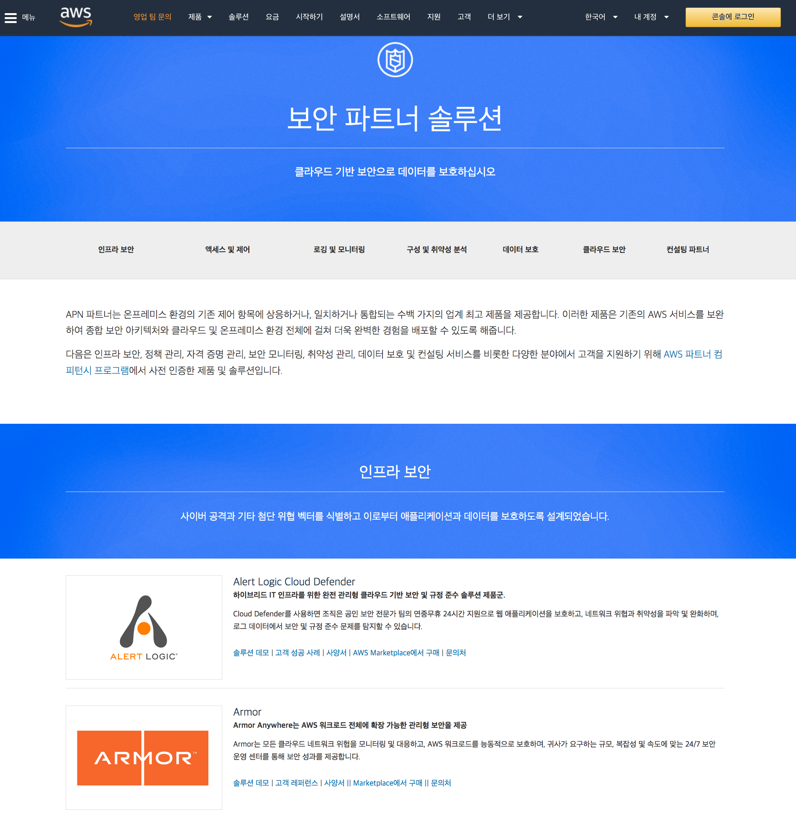

# 글로벌 파트너

## 보안 파트너 포털
[보안 파트너 솔루션](https://aws.amazon.com/ko/security/partner-solutions/) – 보안 관련 글로벌 파트너 업체에 대한 정보를 담고 있는 싸이트 입니다. 제품 별로 고객사례, 데모, 지원 사양, 구매 링크, 문의처 정보가 있습니다.

* [AWS Level 1 MSSP Competency Partners](https://aws.amazon.com/ko/mssp/partner-solutions/?partner-solutions-cards.sort-by=item.additionalFields.partnerNameLower&partner-solutions-cards.sort-order=asc&awsf.partner-solutions-filter-partner-type-storage=*all&awsf.partner-solutions-filter-partner-location-storage=*all&awsm.page-partner-solutions-cards=1)

## 보안 파트너 Quick Starts 

Quick Starts는 고객이 보안 및 고가용성을 위한 AWS 모범 사례에 따라 AWS 상에 인기 있는 솔루션을 배포하는 데 도움이 되도록 AWS 솔루션스 아키텍트와 파트너가 구축합니다. 이러한 레퍼런스 배포는 대개 클릭 한 번으로 1시간 이내에 핵심 기술을 AWS 클라우드에 자동으로 구현합니다. 몇 가지 단계를 거쳐 테스트 또는 프로덕션 환경을 구축하고 즉시 사용을 시작할 수 있습니다. 

본 목록의 기능설명을 보시고 필요한 환경을 활용해 보실 것을 권장드립니다.

__적용 전 반드시 Cost and License 항목을 주의깊게 확인하시기 바랍니다.__

* Check Point : [Check Point CloudGuard Auto Scaling on AWS](https://aws.amazon.com/ko/quickstart/architecture/check-point-cloudguard/) _- G/W 형태의 UTM 제품인 CloudGuard를 Auto-scaling 그룹 설정과 함께 구성하는 CloudFormation 템플릿(적용 시간 30분)_ 
* Trend Micro : [Deep Security on AWS](https://aws.amazon.com/ko/quickstart/architecture/deep-security/) _- Host기반의 IDS/IPS 제품인 DeepSecurity의 Manager/DB 환경을 가용성을 고려하여 구성할 수 있는 CloudFormation 템플릿_
* Trend Micro : [Cloud One Conformity AWS Control Tower integration](https://aws.amazon.com/quickstart/architecture/trend-micro-cloud-one-conformity/)
* Trend Micro : [Trend Micro Cloud One—Workload Security on AWS](https://aws.amazon.com/ko/quickstart/architecture/trend-micro-cloud-one-workload-security/)
* Sophos : [Sophos outbound web proxy on AWS](https://aws.amazon.com/ko/quickstart/architecture/sophos-outbound-web-proxy/) _- 아웃바운드 전용의 웹 프락시 환경을 Auto-Scaling 그룹 설정과 함께 구성하는 CloudFormation 템플릿_
* Symantec : [Symantec Protection Engine on AWS](https://aws.amazon.com/ko/quickstart/architecture/symantec-protection-engine/) _- 멀웨어 방지 및 컨텐츠 스캐닝 기능을 제공하는 SPE 환경을 구성하는 CloudFormation 템플릿_
* PaloAlto & Splunk : [Security and analytics environment on AWS](https://aws.amazon.com/ko/quickstart/architecture/security-analytics-with-palo-alto-networks-and-splunk/) _- G/W 형태의 차세대 방화벽인 PaloAlto VM과 Splunk Enterprise를 함께 구성하여 Enterprise급의 방화벽 로그 분석 환경을 구성하는 CloudFormation 템플릿_
* Aviatrix : [Aviatrix FQDN Egress Filtering on AWS](https://aws.amazon.com/quickstart/architecture/aviatrix-fqdn-egress-filtering/) _- VPC egress 트래픽에 대한 FQDN 필터링 G/W를 구성할 수 있는 템플릿(적용 시간 10분)_
* Aviatrix : [Aviatrix Site to Cloud VPN on AWS](https://aws.amazon.com/ko/quickstart/architecture/aviatrix-site-to-cloud-vpn/)
* Aviatrix : [AWS 기반 Aviatrix User VPN](https://aws.amazon.com/ko/quickstart/architecture/aviatrix-user-vpn/)
* Citrix : [Citrix Virtual Apps and Desktops Service on AWS](https://aws.amazon.com/ko/quickstart/architecture/citrix-virtual-apps/)
* Citrix : [Citrix Web App Firewall (WAF) on AWS](https://aws.amazon.com/quickstart/architecture/citrix-adc-waf/)
* CloudLens & Eastwind : [Security with CloudLens and Eastwind on AWS](https://aws.amazon.com/ko/quickstart/architecture/cloudlens-eastwind/) _- CloudLens(DLP)_
* Duo Security : [Duo MFA(on Radius Proxy) with AWS Directory Service](https://aws.amazon.com/quickstart/architecture/duo-mfa/)
* Pindrop : [Amazon Connect와 통합된 Pindrop](https://aws.amazon.com/ko/quickstart/connect/pindrop/) _- 콜센터 사기 방지 솔루션인 Pindrop과 Amazon Connect 환경을 구성_
* McAfee : [AWS의 McAfee ePolicy Orchestrator](https://aws.amazon.com/ko/quickstart/architecture/mcafee-epolicy-orchestrator/) _- EC2 보안을 위해 McAfee의 엔드포인트 보안 솔루션인 ePO환경을 구성_
* HashiCorp : [AWS 기반 HashiCorp Vault](https://aws.amazon.com/ko/quickstart/architecture/vault/) _- 암호화된 키/밸류 저장소인 HashiCorp Vault 환경을 구성_
* HashiCorp : [Amazon EKS 기반 HashiCorp Vault](https://aws.amazon.com/ko/quickstart/architecture/eks-vault/) _- EKS에서 비밀을 관리하고 암호화하기 위한 통합 인터페이스_
* Informatica : [Informatica Secure@Source on AWS](https://aws.amazon.com/ko/quickstart/architecture/informatica-secureatsource/) _- 민감 정보에 대한 가시성을 제공하는 Secure@Source 환경을 구성_
* Fortinet : [Fortinet FortiGate EC2 Auto Scaling on AWS](https://aws.amazon.com/quickstart/architecture/fortinet-fortigate/)
* Fortinet : [Fortinet FortiGate Auto Scaling Baseline on AWS](https://aws.amazon.com/ko/quickstart/architecture/fortinet-fortigate/) _- 오토스케일링 되는 FortiGate NGFW 환경을 구성_
* F5 : [BIG-IP Virtual Edition(VE) on AWS](https://aws.amazon.com/ko/quickstart/architecture/f5-big-ip-ve/) _- F5 BIG-IP VE환경 구성_
* Microsoft : [AWS 기반 Web Application Proxy](https://aws.amazon.com/ko/quickstart/architecture/wap-adfs/) _- 외부 접근 사용자들을 위한 ADFS와 Window Web App Proxy환경을 구성_
* Microsoft : [AWS의 원격 데스크톱 게이트웨이](https://aws.amazon.com/ko/quickstart/architecture/rd-gateway/)
* Microsoft : [AWS의 Active Directory 도메인 서비스](https://aws.amazon.com/ko/quickstart/architecture/active-directory-ds/) _- MS AD Domain Service 환경을 구성_
* Microsoft : [Microsoft Public Key Infrastructure on AWS](https://aws.amazon.com/ko/quickstart/architecture/microsoft-pki/?nc1=h_ls)
* Microsoft : [CMMC-Ready Microsoft Active Directory](https://aws.amazon.com/quickstart/architecture/cmmc-ready-active-directory/)
* Libreswan : [Opportunistic IPsec mesh for Amazon EC2 instances on AWS](https://aws.amazon.com/ko/quickstart/architecture/libreswan-ipsec-mesh/) _- Libreswan을 이용하여 IPSEC 기반의 암호화 통신기능이 탑재된 EC2환경을 구성_
* DataSunrise : [DataSunrise with Amazon Redshift on AWS](https://aws.amazon.com/quickstart/architecture/datasunrise-with-amazon-redshift/)
* Pindrop : [Pindrop - ensure security, identity, and trust in voice interactions](https://aws.amazon.com/quickstart/connect/pindrop/)
* Nubeva : [Nubeva TLS Decrypt on the AWS Cloud](https://aws.amazon.com/quickstart/architecture/nubeva-tls-decrypt/) _- TLS Termination 후 패킷 분석, IDS/IPS 관련 오픈소스 환경을 구성_
* SumoLogic : [Sumo Logic Security Integrations on AWS](https://aws.amazon.com/quickstart/architecture/sumo-logic/)
* SumoLogic : [Sumo Logic Security Integrations for AWS Organizations](https://aws.amazon.com/ko/quickstart/architecture/sumo-logic-for-aws-organizations/)
* CISCO : [Cisco ASAv RA-VPN on AWS](https://aws.amazon.com/quickstart/architecture/cisco-asav-ravpn/)
* CISCO : [Cisco Duo MFA on AWS](https://aws.amazon.com/quickstart/architecture/duo-mfa/)
* FOGHORN : [Fog360 Security](https://aws.amazon.com/ko/solutions/consulting-offers/foghorn-fog360-security/)
* FOGHORN : [VPC-In-A-Box](https://aws.amazon.com/ko/solutions/consulting-offers/foghorn-vpc-in-a-box/)
* Cohesive : [Cohesive Networks VNS3 on AWS](https://aws.amazon.com/ko/quickstart/architecture/cohesive-networks-vns3/) _- Overlay Network_
* Informatica : [Informatica Secure@Source on AWS](https://aws.amazon.com/ko/quickstart/architecture/informatica-secureatsource/)
* IBM : [IBM Cloud Pak for Security on AWS](https://aws.amazon.com/quickstart/architecture/ibm-cloud-pak-for-security/)
* OKTA : [Okta Advanced Server Access on AWS](https://aws.amazon.com/quickstart/architecture/okta-asa/)
* Suricata : [Amazon EC2 with Suricata on AWS](https://aws.amazon.com/quickstart/architecture/amazon-ec2-suricata/)
* brillio : [Amazon SageMaker with Guardrails on AWS](https://aws.amazon.com/quickstart/architecture/amazon-sagemaker-with-guardrails/)
* Atlassian : [Atlassian Crowd Data Center on AWS](https://aws.amazon.com/quickstart/architecture/atlassian-crowd/)
* Barracuda : [Barracuda CloudGen WAF on AWS](https://aws.amazon.com/quickstart/architecture/barracuda-waf/)
* Darktrace : [Darktrace vSensor](https://aws.amazon.com/quickstart/architecture/darktrace-vsensor/) _- VPC 트래픽 위협탐지_
* Evidian : [Evidian SafeKit on AWS](https://aws.amazon.com/quickstart/architecture/atos-evidian-safekit/) _- 고가용성 지원_
* Snyk : [Snyk Controller for Amazon EKS](https://aws.amazon.com/ko/quickstart/architecture/eks-snyk/) _- EKS환경의 보안취약점 탐지_
* Snyk : [Snyk Security](https://aws.amazon.com/ko/quickstart/architecture/snyk-security/) _- 오픈 소스 취약점을 찾아 자동으로 수정_
* Nubeva : [AWS 클라우드 기반 Nubeva TLS Decrypt](https://aws.amazon.com/ko/quickstart/architecture/nubeva-tls-decrypt/)
* New Relic : [AWS 기반 New Relic AWS Control Tower 통합](https://aws.amazon.com/ko/quickstart/architecture/new-relic-control-tower-integration/) _- AWS Control Tower에서 관리하는 다중 계정 환경 배포_
* superwerker : [AWS 기반 Superwerker](https://aws.amazon.com/ko/quickstart/architecture/superwerker/) _- 보안 BP에 맞춘 멀티 어카운트 환경 셋업_

## AWS Gateway Load Balancer(GWLB) 연동 파트너(외부 링크)

* Check Point - [Check Point CloudGuard integrates with AWS Gateway Load Balancer at Launch](https://blog.checkpoint.com/2020/11/10/check-point-cloudguard-integrates-with-aws-gateway-load-balancer-at-launch/)
* Check Point - [CloudGuard Network Security for AWS Gateway Load Balancer Architecture Options](https://supportcenter.checkpoint.com/supportcenter/portal?eventSubmit_doGoviewsolutiondetails=&solutionid=sk174447)
* Check Point - [CloudGuard Network Security streamlines operational efficiency with as-a-Service solution on AWS](https://blog.checkpoint.com/2021/11/29/check-point-cloudguard-network-security-streamlines-operational-efficiency-with-as-a-service-solution-on-aws/)
* Cisco - [Cisco Cloud ACI & AWS continued journey in the cloud](https://blogs.cisco.com/datacenter/cisco-cloud-aci-aws-continued-journey-in-the-cloud-2)
* Cisco - [Snort 3 Anywhere](https://blogs.cisco.com/security/snort-3-anywhere)
* Cisco - [Secure Firewall-as-a-service (FWaaS) on AWS](https://blogs.cisco.com/security/simplify-network-security-with-cisco-secure-firewall-as-a-service-fwaas-on-aws)
* Cisco - [Simplify Network Security with Cisco Secure Firewall-as-a-service (FWaaS) on AWS](https://blogs.cisco.com/security/simplify-network-security-with-cisco-secure-firewall-as-a-service-fwaas-on-aws)
* Cisco - [Building a Scalable Security Architecture on AWS with Cisco Secure Firewall and AWS Gateway Load Balancer](https://blogs.cisco.com/security/building-a-scalable-security-architecture-on-aws-with-cisco-secure-firewall-and-aws-transit-gateway)
* Fortinet - [Highly Scalable FortiGate Next Generation Firewall Security on AWS Gateway Load Balancer Service](https://www.fortinet.com/blog/business-and-technology/highly-scalable-fortigate-next-generation-firewall-security-on-aws-gateway-load-balancer-service)
* Fortinet - [FortiGate NGFW - Creating the GWLB and registering targets](https://docs.fortinet.com/document/fortigate/6.4.0/aws-cookbook/249812/creating-the-gwlb-and-registering-targets)
* Fortinet - [FortiGate NGFW - Post-deployment configuration](https://docs.fortinet.com/document/fortigate/6.4.0/aws-cookbook/360322/post-deployment-configuration)
* PaloAlto - [PaloAlto VM-Series Virtual Firewalls Integrate With AWS Gateway Load Balancer](https://blog.paloaltonetworks.com/2020/11/netsec-aws-gateway-load-balancer-integration/)
* PaloAlto - [Palo Alto VM-Series and AWS GWLB Integration Overview](https://www.youtube.com/watch?v=MFdFxhcIV9g&feature=youtu.be)
* Radware - [Deploy and Scale DDoS Protection in the Public Cloud](https://blog.radware.com/security/ddos/2020/11/deploy-and-scale-ddos-protection-in-the-public-cloud/)
* Trend Micro - [Cloud One – Integrates with AWS Gateway Load Balancer for Improved Security Function](https://newsroom.trendmicro.com/2020-11-10-Trend-Micro-Integrates-with-AWS-Gateway-Load-Balancer-for-Improved-Security-Function)
* Trend Micro - [Cloud One Network Security-as-a-Service](https://www.trendmicro.com/en_ca/research/21/k/trend-micro-cloud-one-network-security-as-a-service.html)
* Valtix - [Valtix brings Advanced Network Security into Cloud Era with AWS Gateway Load Balancer](https://www.valtix.com/blog/valtix-aws-gwlb)
* Valtix - [Valtix Network Security Service with AWS Gateway Load Balancer](https://www.youtube.com/watch?v=oxiCYphGD0U&feature=youtu.be)
* F5 - [BIG-IP Virtual Edition - BEST (PAYG, 1Gbps)](https://aws.amazon.com/marketplace/pp/prodview-atilk7h6dqu6k)
* [How cPacket cCloud Solution Leverages GWLB?](https://www.cpacket.com/blog/cpacket-networks-cloud-visibility-with-amazon-gateway-load-balancer/)
* [Bringing Glasnostic’s Traffic Control to AWS Gateway Load Balancer](https://glasnostic.com/blog/news-glasnostic-aws-gateway-load-balancer)
* [AWS Gateway Load Balancer Enhances NETSCOUT Visibility in AWS](https://www.netscout.com/blog/aws-enhances-netscout-visibility)
* [Introduction to Traffic Mirroring to GWLB Endpoints as Target](https://aws.amazon.com/ko/blogs/networking-and-content-delivery/introduction-to-traffic-mirroring-to-gwlb-endpoints-as-target/)

			
## AWS 글로벌 보안 파트너와 관련된 기타 유용한 링크들

* [AWS Marketplace 보안](https://docs.aws.amazon.com/ko_kr/marketplace/latest/userguide/security.html)
* GIT - [Packet Capture on AWS](https://github.com/tradichel/PacketCaptureAWS#packet-capture-on-aws) _- WatchGuard Firebox 솔루션을 이용하여 AWS 환경에서 패킷 캡쳐를 할 수 있는 환경 구성_
* GIT - [Infra secret management overview](https://gist.github.com/maxvt/bb49a6c7243163b8120625fc8ae3f3cd) _- 클라우드 상의 인프라(서버, DB, WAS 등)의 중요 비밀 정보(암호, 인증서 등)들을 안전하게 관리할 수 있는 기능을 제공하는 제품들에 대한 리뷰 싸이트_
* TrendMicro - [Integrate Deep Security with AWS Services](https://automation.deepsecurity.trendmicro.com/article/12_0/integrate-deep-security-with-aws-services?platform=on-premise) _- 외부 블로그, Deep Security와 GuardDuty, Macie, Inspector, WAF, Config 간 연동방식을 설명_
* Trend Micro - [Trend Micro CloudOne - Share threat intelligence with AWS](https://cloudone.trendmicro.com/docs/network-security/share_threat_intel/)
* GDPR 관련 포인트 솔루션 - [OneTrust](https://www.onetrust.com/), [NYMITY](https://www.nymity.com/), [GROUND LABS](https://www.groundlabs.com/enterprise-recon/)
* PII DLP 관련 솔루션 - [BIG ID](https://bigid.com/), [wirewheel](https://wirewheel.io/)
* CloudConformity - [security checking rules](https://www.cloudconformity.com/conformity-rules/)
* Splunk(GIT) - [About the AWS Security Hub to Splunk integration](https://github.com/splunk/splunk-for-securityHub)
* Splunk(GIT) - [Trumpet - Splunk](https://github.com/splunk/splunk-aws-project-trumpet)
* Splunk - [Automating AWS Data Ingestion into Splunk](https://www.splunk.com/en_us/blog/partners/automating-aws-data-ingestion-into-splunk.html)
* Splunk - [View Amazon CloudWatch logs for Amazon RDS in Splunk Cloud Platform](https://aws.amazon.com/ko/blogs/database/view-amazon-cloudwatch-logs-for-amazon-rds-in-splunk-cloud-platform/)
* Widdix(S3 멀웨어 및 컨텐츠 스캐닝 관련 솔루션들) - [Widdix - S3 VirusScan](https://aws.amazon.com/marketplace/pp/B07XFR781T), [Symantec - Content and Malware Analysis](https://aws.amazon.com/marketplace/pp/B07P67QT46?ref_=srh_res_product_title)
* DataSunrise(DB 방화벽, 접근제어 등의 패키지 솔루션) - [DataSunrise Database and Data Security](https://aws.amazon.com/marketplace/seller-profile?id=880a5857-74c1-44ea-a978-094093c08788&ref=dtl_B01KBHGHXA)
* OWASP 스캐너 - [Introduction to OWASP ZAP for Web Application Security Assessments](https://resources.infosecinstitute.com/introduction-owasp-zap-web-application-security-assessments/#gref)
* OWASP 스캐너 - [Vulnerability Scanning Tools](https://owasp.org/www-community/Vulnerability_Scanning_Tools) 
* Centrify - [Adding and configuring a Custom SAML application](https://docs.centrify.com/Content/Applications/AppsCustom/AddConfigSAML.htm)
* G-Suite - [Set up your own custom SAML application](https://support.google.com/a/answer/6087519?hl=en)
* PING - [Add or update a SAML application](https://documentation.pingidentity.com/pingone/employeeSsoAdminGuide/index.shtml#enableAppWithoutURL.html)
* PING - [AWS Single Sign-On Connector](https://support.pingidentity.com/s/marketplace-integration/a7i1W000000TOZ1/aws-single-signon-connector)
* PING - [Building SAML federation for Amazon OpenSearch Dashboards with Ping Identity](https://aws.amazon.com/ko/blogs/architecture/building-saml-federation-for-amazon-opensearch-dashboards-with-ping-identity/)
* OKTA - [Manage Amazon EKS with Okta SSO](https://aws.amazon.com/blogs/containers/manage-amazon-eks-with-okta-sso/)
* OKTA - [Integrating OKTA identity service provider with NICE EnginFrame](https://aws.amazon.com/blogs/hpc/integrating-okta-identity-service-provider-with-nice-enginframe/)
* OKTA - [Building SAML federation for Amazon OpenSearch Dashboards with Okta](https://aws.amazon.com/ko/blogs/architecture/building-saml-federation-for-amazon-opensearch-dashboards-with-okta/)
* CheckPoint - [AWS Security microsite](https://www.checkpoint.com/solutions/amazon-aws-security/)
* Dataguise - [Automatically Detect and Protect Sensitive Data in Amazon S3 Using Dataguise DgSecure](https://aws.amazon.com/blogs/apn/automatically-detect-and-protect-sensitive-data-in-amazon-s3-using-dataguise-dgsecure/)
* CloudKnox - [Continuous permissions rightsizing to ensure least privileges in AWS using CloudKnox and AWS Config](https://aws.amazon.com/blogs/mt/continuous-permissions-rightsizing-ensure-least-privileges-aws-using-cloudknox-aws-config/)
* Sumo Logic - [Multi-Cloud and Hybrid Threat Protection with Sumo Logic Cloud SIEM Powered by AWS](https://aws.amazon.com/blogs/aws/hybrid-threat-protection-with-sumo-logic-cloud-siem-powered-by-aws/)
* Palo Alto - [Rapid, Automated Firewall Deployment Comes to AWS](https://www.paloaltonetworks.com/blog/network-security/vm-series-ngfw-orchestration-for-aws/)
* Palo Alto - [Getting started with AWS Firewall Manager PaloAlto Cloud NGFW policies](https://docs.aws.amazon.com/waf/latest/developerguide/getting-started-fms-cloud-ngfw.html)
* Azure AD - [Automate SAML 2.0 federation for AWS multi-account environments that use Azure AD](https://docs.aws.amazon.com/ko_kr/prescriptive-guidance/latest/patterns/automate-saml-2-0-federation-for-aws-multi-account-environments-that-use-azure-ad.html)
* Sophos - [Deploy Sophos web proxy UTM and Outbound Gateway on AWS](https://docs.aws.amazon.com/ko_kr/prescriptive-guidance/latest/patterns/deploy-sophos-web-proxy-utm-and-outbound-gateway-on-aws.html)
* F5 - [Migrate an F5 BIG-IP workload to F5 BIG-IP VE on the AWS Cloud](https://docs.aws.amazon.com/ko_kr/prescriptive-guidance/latest/patterns/migrate-an-f5-big-ip-workload-to-f5-big-ip-ve-on-the-aws-cloud.html)
* CrowdStrike(GIT) - [CrowdStrike and AWS Systems Manager](https://github.com/CrowdStrike/Cloud-AWS/blob/master/systems-manager/documentation/AWS-Systems-Manager-Intro.md)
* CrowdStrike - [Defense-in-Depth Principles for Protecting Workloads with CrowdStrike and AWS](https://aws.amazon.com/blogs/apn/defense-in-depth-principles-for-protecting-workloads-with-crowdstrike-and-aws/)
* FortiNet - [FortiGurad Labs. - Managed IPS Rules for AWS Network Firewall](https://www.fortinet.com/products/managed-ips-rules-for-aws)
* Barracuda - [Anatomy of a Supply Chain Ransomware Attack and How to Prevent it with Barracuda’s CloudGen WAF on AWS](https://aws.amazon.com/blogs/apn/anatomy-of-a-supply-chain-ransomware-attack-and-how-to-prevent-it-with-barracuda-cloudgen-waf-on-aws/)
* Aviatrix - [Gaining Critical Security Insights and Control of Your Traffic with Aviatrix ThreatIQ and ThreatGuard](https://aws.amazon.com/ko/blogs/apn/gaining-critical-security-insights-and-control-of-your-traffic-with-aviatrix-threatiq-and-threatguard/)
* Zscaler - [Harden Your Cloud Security Posture in 3 Simple Steps with Zscaler](https://aws.amazon.com/ko/blogs/apn/harden-your-cloud-security-posture-in-3-simple-steps-with-zscaler/)
* PaloAlto(Blog) - [Securing ingress using security solutions and AWS Transit Gateway](https://aws.amazon.com/blogs/networking-and-content-delivery/securing-ingress-using-security-solutions-and-aws-transit-gateway/) _- PaloAlto VM-series와 TGW 연계_
* Immuta(Blog) - [Implementing Centralized Fine-Grained Access Control with Immuta and AWS](https://aws.amazon.com/ko/blogs/apn/implementing-centralized-fine-grained-access-control-with-immuta-and-aws/)
* OpenVPN(Blog) - [Setting up OpenVPN Access Server in Amazon VPC](https://aws.amazon.com/blogs/awsmarketplace/setting-up-openvpn-access-server-in-amazon-vpc/)
* Snowflake(Blog) - [Using AWS PrivateLink for Amazon S3 for Private Connectivity Between Snowflake and Amazon S3](https://aws.amazon.com/blogs/apn/using-aws-privatelink-for-amazon-s3-for-private-connectivity-between-snowflake-and-amazon-s3/)
* IronNet(Blog) - [Protecting Your Deployments from Advanced Threats with AWS and IronNet](https://aws.amazon.com/blogs/apn/protecting-your-deployments-from-advanced-threats-with-aws-and-ironnet/)
* Juniper(Blog) - [How to Enhance Protection of AWS Workloads with the Juniper cSRX Container Firewall in Amazon EKS](https://aws.amazon.com/ko/blogs/apn/how-to-enhance-protection-of-aws-workloads-with-the-juniper-csrx-container-firewall-in-amazon-eks/)
* NoSpamProxy(Blog) - [How Net at Work built an email threat report system on AWS](https://aws.amazon.com/ko/blogs/architecture/how-net-at-work-built-an-email-threat-report-system-on-aws/)
* Lacework(Blog) - [Securing your AWS Control Tower multi-account environment with Lacework](https://aws.amazon.com/blogs/awsmarketplace/securing-your-aws-control-tower-multi-account-environment-with-lacework/)
* Blog - [Maintaining Control of PII Hosted on AWS with Hold Your Own Key (HYOK) Security](https://aws.amazon.com/blogs/apn/maintaining-control-of-pii-hosted-on-aws-with-hold-your-own-key-hyok-security/)
* Blog - [Vulnerability Management Considerations for Rapid Amazon EC2 Growth](https://aws.amazon.com/ko/blogs/apn/vulnerability-management-considerations-for-rapid-amazon-ec2-growth/)
* Blog - [Security and Compliance at Scale with CloudHealth Secure State](https://aws.amazon.com/blogs/apn/security-and-compliance-at-scale-with-cloudhealth-secure-state/)
* Blog - [Isolating SaaS Tenants with Dynamically Generated IAM Policies](https://aws.amazon.com/ko/blogs/apn/isolating-saas-tenants-with-dynamically-generated-iam-policies/)
* Blog - [Integrating Microsoft Active Directory with AWS Certificate Manager Private CA Using Secardeo certEP](https://aws.amazon.com/blogs/apn/integrating-microsoft-active-directory-with-aws-certificate-manager-private-ca-using-secardeo-certep/)
* Blog - [SaaS Identity and Routing with Istio Service Mesh and Amazon EKS](https://aws.amazon.com/ko/blogs/apn/saas-identity-and-routing-with-istio-service-mesh-and-amazon-eks/)
* Blog - [AWS DevOps Competency Expands to Include DevSecOps Category](https://aws.amazon.com/ko/blogs/apn/aws-devops-competency-expands-to-include-devsecops-category/)
* Blog - [Automate multi-account IP address management in AWS with BlueCat and AWS Control Tower](https://aws.amazon.com/ko/blogs/awsmarketplace/automate-multi-account-ip-address-management-aws-bluecat-aws-control-tower/)
* Blog - [Create a secure and fast DevSecOps pipeline with CircleCI](https://aws.amazon.com/ko/blogs/publicsector/create-a-secure-and-fast-devsecops-pipeline-with-circleci/)
* Blog - [A FinTech Roadmap to Data Security and Compliance with VGS and AWS](https://aws.amazon.com/blogs/apn/a-fintech-roadmap-to-data-security-and-compliance-with-vgs-and-aws/)
* Blog - [Manage Multi-Tenant Remote Access with Cisco Secure Firewall Cloud Native on Amazon EKS](https://aws.amazon.com/blogs/apn/manage-multi-tenant-remote-access-with-cisco-secure-firewall-cloud-native-on-amazon-eks/)
* Blog - [Integrating Amazon S3 Virus Scanning into Your Application Workflow with Cloud Storage Security](https://aws.amazon.com/blogs/apn/integrating-amazon-s3-virus-scanning-into-your-application-workflow-with-cloud-storage-security/)
* Blog - [Modernize your Utility’s SOC and build better security with Splunk Cloud Platform on AWS](https://aws.amazon.com/blogs/industries/modernize-your-utilitys-soc-and-build-better-security-with-splunk-cloud-platform-on-aws/)
* Blog - [Create AWS Accounts and Align to the CIS AWS Foundations Benchmark with Stax](https://aws.amazon.com/blogs/apn/create-aws-accounts-and-align-to-the-cis-aws-foundations-benchmark-with-stax/)
* Blog - [How to Mask Sensitive Data on AWS Using DataMasque](https://aws.amazon.com/blogs/apn/how-to-mask-sensitive-data-on-aws-using-datamasque/)
* Blog - [CyberArk Identity as SSO for AWS Control Tower](https://aws.amazon.com/blogs/awsmarketplace/cyberark-identity-sso-aws-control-tower/)
* Blog - [Managing Cybersecurity Risks with the Next Generation of Managed Security Services](https://aws.amazon.com/blogs/apn/managing-cybersecurity-risks-with-the-next-generation-of-managed-security-services/)
* Blog - [Build and Deploy a Secure Container Image with AWS and Snyk](https://aws.amazon.com/ko/blogs/apn/build-and-deploy-a-secure-container-image-with-aws-and-snyk/)
* Blog - [Implementing Zero-Trust Workload Security on Amazon EKS with Calico](https://aws.amazon.com/blogs/apn/implementing-zero-trust-workload-security-on-amazon-eks-with-calico/)

## Remarks

* 이 사이트의 모든 내용은 바뀌거나 수정될 수 있습니다.
* 공식적인 상세한 내용은 http://aws.amazon.com 의 내용을 참조하십시오.
* 제공되는 내용에 이견이 있거나 잘못된 링크를 발견하시면, 관리자(gisunlim@amazon.com)에게 메일을 주시면 대단히 감사하겠습니다.

---

[개인 정보 보호 정책](https://aws.amazon.com/privacy/?nc1=f_pr) | [사이트 이용 약관](https://aws.amazon.com/terms/?nc1=f_pr) | © 2020, Amazon Web Services, Inc. 또는 자회사. All rights reserved. 

