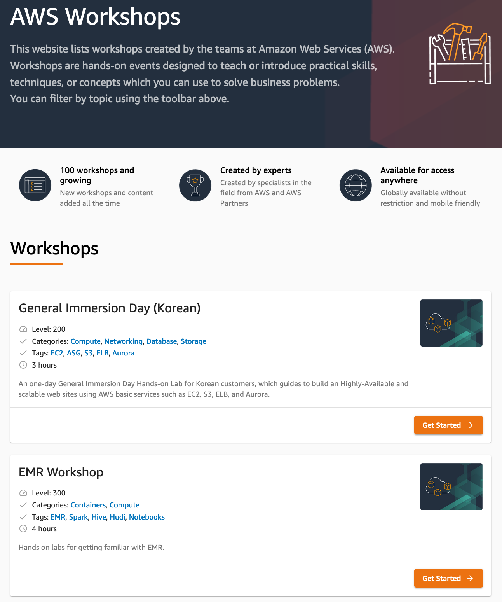

# AWS Security 관련 핸즈온 랩 및 데모

AWS 보안 관련 핸즈온 랩 및 데모 사이트 링크들을 모아 놓았습니다. AWS 보안 기능, 서비스, 파트너 제품, 모범 사례 등 다양한 내용들을 링크의 가이드에 따라 직접 실습을 해 보면서 보다 잘 이해하실 수 있습니다.

**주의 사항**

* 본 목록의 핸즈온 랩 및 데모를 진행하는데는 대부분의 경우 비용이 발생합니다. AWS 요금 또는 파트너 제품의 사용 요금 등 제반 비용에 대해서는 기본적으로는 실습자 부담이기 때문에, 각 핸즈온 랩 가이드에 나와 있는 비용 관련 내용을 숙지하고 실습 여부를 판단해야 합니다.
* 특별한 이유가 없는 한, 실습 후에는 반드시 실습 환경을 삭제하여 더이상 과금되지 않도록 각별히 유념하시기 바랍니다.

## [AWS Workshop](https://www.workshops.aws/)

[AWS Workshop](https://www.workshops.aws/)은 AWS에서 제공하는 핸즈온 워크샵들을 모아 놓은 웹 싸이트 입니다. 보안 관련 주제도 포함되어 있으며, 계시된 레벨과 소요시간, 관련 서비스 정보를 참조하여 실습을 진행하실 수 있습니다.

* [Getting Started with Security on AWS](https://catalog.us-east-1.prod.workshops.aws/workshops/f21a1ec6-e7bc-482c-a6fc-9f53d28f8ac7/en-US)
* [Integrating IAM Access Analyzer into a CI/CD Pipeline](https://workshops.aws/card/Analyzer) _- Level:300, 2Hr_
* [Data Perimeter Workshop](https://data-perimeter.workshop.aws/) _- Level:400, 2Hr_
* [AWS Network Firewall Workshop](https://networkfirewall.workshop.aws/) _- Level:400, 2Hr_
* [제로 트러스트 에피소드 1 - The Phantom Service Perimeter](https://catalog.us-east-1.prod.workshops.aws/v2/workshops/dc413216-deab-4371-9e4a-879a4f14233d/ko-KR/) _- Level:200, 2Hr_
* [VPC Flowlogs Analysis using Amazon Elasticsearch Service](https://amazon-es-vpc-flowlogs.workshop.aws/) _- Level:200, 2Hr_
* [AWS Networking Workshop](https://networking.workshop.aws/) _- Level:300, 8Hr_
* [Scaling your encryption at rest capabilities with AWS KMS](https://kms-encryption-at-rest.workshop.aws/) _- Level:200, 2Hr_
* [Management_Governance_Immersion_Day](https://mng.workshop.aws/) _- Level:100~200, Modular_
* [re:Inforce TDR254 - Building an AWS incident response plan using Jupyter notebooks](https://reinforce-tdr254.workshop.aws/) _- Level:200, 2Hr_
* [Building Prowler into a QuickSight powered AWS security dashboard](https://quicksight-security-dashboard.workshop.aws/) _- Level:300, 2Hr_
* [AWS Encryption Tutorial](https://encryption-ws.workshop.aws/) _- Level:200, 5Hr_
* [AWS Incident Response Playbooks Workshop](https://catalog.us-east-1.prod.workshops.aws/v2/workshops/43742d64-6a5e-45ea-9339-cbb3fb26944e/) _- Level:400, 2Hr_
* [Data Discovery and Classification with Amazon Macie](https://data-discovery-and-classification.workshop.aws/) _- Level:200, 2Hr_
* [Hands on Network Firewall Workshop](https://hands-on-network-firewall.workshop.aws/) _- Level:400, 2Hr_
* [SIEM on Amazon Elasticsearch Service Workshop](https://security-log-analysis-platform.workshop.aws/) _- Level:200, 2Hr_
* [AWS CloudTrail Monitoring with Amazon CloudWatch](https://cloudtrail-with-cloudwatch.workshop.aws/) _- Level:300, 3Hr_
* [Implementing DDoS Resiliency](https://ddos-protection-best-practices.workshop.aws/) _- Level:300, 2Hr_
* [CloudEndure Disaster Recovery Workshop](https://cloudendure-dr.workshop.aws/) _- Level: 200, 6Hr_
* [Risk and Compliance Immersion Day](https://risk-compliance.workshop.aws/) _- Level:100, 2Hr_
* [Disaster Recovery on AWS](https://disaster-recovery.workshop.aws/) _- Level: 300, 8Hr_
* [Active Directory on AWS Immersion Day](https://ad-immersionday.workshop.aws/) _- Level:200, 4Hr_
* [DevSecOps on AWS](https://devsecops.workshop.aws/) _- Level:400, 3Hr_
* [Introduction to WAF](https://introduction-to-waf.workshop.aws/) _- Level:300, 2Hr_
* [Firewall Manager service - WAF policy](https://introduction-firewall-manager.workshop.aws/) _- L:evel:200, 2Hr_
* [Studying S3 presigned URL feature](https://s3-presigned-url.workshop.aws/) _- Level:400, 1Hr_
* [Integration, Prioritization, and Response with AWS Security Hub](https://security-hub-workshop.awssecworkshops.com/) _- Level:300, 3Hr_
* [AWS Identity: Using Amazon Cognito for serverless consumer apps](https://catalog.us-east-1.prod.workshops.aws/v2/workshops/bc60f0b2-991f-4df9-933c-234a67e75179/en-US) _- Level:400, 2Hr_
* [Scaling threat detection and response on AWS](https://scaling-threat-detection.awssecworkshops.com/) _- Level:300, 2Hr_
* [Finding and addressing Network Misconfigurations on AWS](https://validating-network-reachability.awssecworkshops.com/) _- LevelL300, 2Hr_
* [Infrastructure Identity on AWS](https://idm-infrastructure.awssecworkshops.com/) _- Level: 300, 2Hr_
* [DevSecOps - Integrating security into your pipeline](https://devops.awssecworkshops.com/) _- Level:300, 2Hr_
* [Build a Vulnerability Management Program Using AWS for AWS](https://vul-mgmt-program.awssecworkshops.com/) _- Level:300, 2Hr_
* [Serverless Identity](https://identity-round-robin.awssecworkshops.com/serverless/) _- Level: 300, 2Hr_
* [Permissions boundaries: how to delegate permissions on AWS](https://identity-round-robin.awssecworkshops.com/permission-boundaries-advanced/) _- Level:400, 2Hr_
* [Access Delegation](https://identity-round-robin.awssecworkshops.com/delegation/) _- Level:200, 2Hr_
* [Data Protection](https://data-protection.awssecworkshops.com/) _- Level: 300, 2Hr_
* [Integrating security into your container pipeline](https://container-devsecops.awssecworkshops.com/) _- Level:300, 2Hr_
* [Getting Hands on with Amazon GuardDuty](https://hands-on-guardduty.awssecworkshops.com/) _- Level:300, 2Hr_
* [Ransomware prevention strategies in Amazon S3](https://catalog.us-east-1.prod.workshops.aws/v2/workshops/6484b52f-39fa-45cf-937c-95af1ea29b6b/) _- Level:200, 1Hr_
* [Secure Hybrid Access to S3 using VPC Endpoints](https://catalog.us-east-1.prod.workshops.aws/v2/workshops/3a8d4ddf-66c5-4d26-ae6f-6292a517f46c/en-US) _- Level: 300, 1Hr_
* [Amazon VPC Endpoint Workshop](https://www.vpcendpointworkshop.com/) _- Level:300, 3Hr_
* [Store, retrieve and manage sensitive credentials in AWS Secrets Manager](https://catalog.us-east-1.prod.workshops.aws/v2/workshops/497b4908-169f-4e6f-b80d-ef10be3038d3/en-US) _- Level:300, 2Hr_
* [ACM Private Certificate Authority (ACM Private CA) Workshop](https://github.com/aws-samples/data-protection/tree/master/usecase-9)
* [Multi-Account Security Governance Workshop](https://catalog.us-east-1.prod.workshops.aws/v2/workshops/d3f60827-89f2-46a8-9be7-6e7185bd7665/en-US) _- Level:200, 3Hrs_
* [Workshop: Building remediation workflows to simplify compliance](https://catalog.us-east-1.prod.workshops.aws/v2/workshops/65e30a39-2f37-4e82-ba04-3ad41328fb5b/en-US/) _- Level:400, 2Hrs_
* [Integrating AWS IAM Access Analyzer in a CI/CD Pipeline](https://catalog.us-east-1.prod.workshops.aws/v2/workshops/fff8e490-f397-43d2-ae26-737a6dc4ac68/en-US) _- Level: 300-400, 3Hrs_
* [Security Hub Workshop](https://catalog.us-east-1.prod.workshops.aws/v2/workshops/adccbda9-ceaf-47a8-843b-cf231281b635/en-US/) _- Level:200, 3 Hrs_
* [Vulnerability Management with Amazon Inspector](https://catalog.us-east-1.prod.workshops.aws/workshops/863fe895-a98e-4a9f-a222-05f7f0e321a2/en-US/) _- Level:200, 2 Hrs_
* [AWS Firewall Manager Workshop - Audit and Manage Firewall rules](https://catalog.workshops.aws/firewall-manager/en-US) _- Level:200, 3:30_
* [AWS IAM Workshop(한글)](https://catalog.us-east-1.prod.workshops.aws/workshops/dd23d392-bea4-483c-aefd-f62ed73f936d/en-US) _- Level:200, 3hr_
* [Amazon GuardDuty Workshop](https://catalog.workshops.aws/guardduty/en-US) _- Level:200, 3hr_
* [Visualize Security Hub Findings using Analytics Tools](https://catalog.workshops.aws/visualizing-securityhub-findings/en-US) _- Level:300,3hr_
* [Threat modeling the right way for builders](https://catalog.workshops.aws/threatmodel/en-US) _- Level:200, 3hr_
* [AWS Config 워크샵](https://catalog.us-east-1.prod.workshops.aws/workshops/6d057868-fd57-4029-a708-90f8b7f00388/ko-KR) _- Level:200_

## [AWS Well Architected Security Labs](https://www.wellarchitectedlabs.com/Security/README.html)

* [Level 100: AWS Account and Root User](https://www.wellarchitectedlabs.com/Security/100_AWS_Account_and_Root_User/README.html)
* [Level 100: Basic Identity and Access Management User, Group, Role](https://www.wellarchitectedlabs.com/Security/100_Basic_Identity_and_Access_Management_User_Group_Role/README.html)
* [Level 100: CloudFront with S3 Bucket Origin](https://www.wellarchitectedlabs.com/Security/100_CloudFront_with_S3_Bucket_Origin/README.html)
* [Level 100: Enable Security Hub](https://www.wellarchitectedlabs.com/Security/100_Enable_Security_Hub/README.html)
* [Level 200: Automated Deployment of Detective Controls](https://www.wellarchitectedlabs.com/Security/200_Automated_Deployment_of_Detective_Controls/README.html)
* [Level 200: Automated Deployment of EC2 Web Application](https://www.wellarchitectedlabs.com/Security/200_Automated_Deployment_of_EC2_Web_Application/README.html)
* [Level 200: Automated Deployment of IAM Groups and Roles](https://www.wellarchitectedlabs.com/Security/200_Automated_Deployment_of_IAM_Groups_and_Roles/README.html)
* [Level 200: Automated Deployment of VPC](https://www.wellarchitectedlabs.com/Security/200_Automated_Deployment_of_VPC/README.html)
* [Level 200: Automated Deployment of Web Application Firewall](https://www.wellarchitectedlabs.com/Security/200_Automated_Deployment_of_Web_Application_Firewall/README.html)
* [Level 200: Automated IAM User Cleanup](https://www.wellarchitectedlabs.com/Security/200_Automated_IAM_User_Cleanup/README.html)
* [Level 200: Basic EC2 with WAF Protection](https://www.wellarchitectedlabs.com/Security/200_Basic_EC2_with_WAF_Protection/README.html)
* [Level 200: Certificate Manager Request Public Certificate](https://www.wellarchitectedlabs.com/Security/200_Certificate_Manager_Request_Public_Certificate/README.html)
* [Level 200: CloudFront with WAF Protection](https://www.wellarchitectedlabs.com/Security/200_CloudFront_with_WAF_Protection/README.html)
* [Level 300: IAM Permission Boundaries Delegating Role Creation](https://www.wellarchitectedlabs.com/Security/300_IAM_Permission_Boundaries_Delegating_Role_Creation/README.html)
* [Level 300: IAM Tag Based Access Control for EC2](https://www.wellarchitectedlabs.com/Security/300_IAM_Tag_Based_Access_Control_for_EC2/README.html)
* [Level 300: Incident Response Playbook with Jupyter - AWS IAM](https://www.wellarchitectedlabs.com/Security/300_Incident_Response_Playbook_with_Jupyter-AWS_IAM/README.html)
* [Level 300: Incident Response with AWS Console and CLI](https://www.wellarchitectedlabs.com/Security/300_Incident_Response_with_AWS_Console_and_CLI/README.html)
* [Level 300: Lambda Cross Account IAM Role Assumption](https://www.wellarchitectedlabs.com/Security/300_Lambda_Cross_Account_IAM_Role_Assumption/README.html)

 
## AWS 보안 서비스 관련 핸즈온 랩 및 데모

* [AWS Security Workshop](https://awssecworkshops.com/)
* [Identity Round Robin](https://identity-round-robin.awssecworkshops.com/)
* [SAML 2.0 기반의 Federation에 대한 워크샵](http://federationworkshopreinvent2016.s3-website-us-east-1.amazonaws.com/) _– SAML 2.0을 지원하는 Shibboleth 3.x(with OpenLDAP)이나 MS ADFS기반의 IDP 환경을 AWS 콘솔과 Federtion하는 방법을 정리한 싸이트(AWS Single Sign-On을 이용하지 않는 방법)_
* [Web Identity Federation Playground](https://web-identity-federation-playground.s3.amazonaws.com/index.html) _- 웹 자격 증명 연동이 어떤 방식으로 작동하는지에 대한 이해를 돕는 시뮬레이션 싸이트_
* [AWS Data Protection Workshops](https://github.com/aws-samples/data-protection)
* [A Busy Engineer’s Guide to the AWS Encryption SDK](http://busy-engineers-guide.reinvent-workshop.com/)
* [AWS KMS Workshop](https://github.com/aws-samples/aws-kms-workshop)
* [Control Tower Immersion Day](https://controltower.aws-management.tools/)
* [AWS Secrets Manager Workshop](https://github.com/aws-samples/aws-secretsmgr-workshop)
* [modernization-unicorn-store](https://github.com/aws-samples/modernization-unicorn-store/tree/v1.0) _- 컨테이너 환경의 .NET 앱들과 Secret Manager 연계_
* [Config HOL](https://workshop.aws-management.tools/config/)
* [CloudWatch HOL](https://workshop.aws-management.tools/cloudwatch/)
* [CloudTrail HOL](https://workshop.aws-management.tools/cloudtrail/)
* [Service Catalog HOL](https://workshop.aws-management.tools/servicecatalog/)
* [License Manager HOL](https://workshop.aws-management.tools/licensemanager/)
* [System Manager HOL](https://workshop.aws-management.tools/ssm/)
* [System Manager Compliance HOL](https://workshop.aws-management.tools/ssm/use-case-labs/configurationcompliance/)
* [AWS WAF Workshop](https://waf.solution.builders/00-introduction/)
* [AWS WAF 공격 및 방어 실습](https://sessin.github.io/awswafhol/)
* [Workshop - Protecting Workloads on AWS from the Instance to the Edge](https://protecting-workloads.awssecworkshops.com/)
* [AWS Workshops - Security](https://www.workshops.aws/categories/Security)
* [AWS Workshops - IAM](https://www.workshops.aws/categories/IAM)
* [AWS Workshops - Networking](https://www.workshops.aws/categories/Networking)
* [AWS Workshops - Identity](https://www.workshops.aws/categories/Identity)
* [AWS Workshops - Data Protection](https://www.workshops.aws/categories/Data%20Protection)
* [AWS Workshops - Active Directory](https://www.workshops.aws/categories/Active%20Directory)
* [AWS IAM Hands On Lab(한글)](https://whchoi98.gitbook.io/aws-iam/)
* [AWS 환경에서의 침해사고 대응 워크샵](http://gslim-public-workshops.s3-website.ap-northeast-2.amazonaws.com/incidentresponseworkshop/)
* [Landing Zone Immersion Day](https://www.immersionday.com/landing-zone/)
* [Cognito authentication](https://serverless-game-analytics.workshop.aws/en/cognito.html)
* [Using Amazon Cognito for serverless consumer apps](https://serverless-idm.awssecworkshops.com/)
* [AWS Nitro Enclaves Workshop](https://nitro-enclaves.workshop.aws/en/)
* [SIEM on Amazon Elasticsearch Service Workshop](https://security-log-analysis-platform.workshop.aws/en/)
* [AWS CLIENT VPN BASIC WORKSHOP (Korean)](https://catalog.us-east-1.prod.workshops.aws/v2/workshops/c6f34556-1d8d-4123-9805-c352db828e16/ko-KR)

## AWS 서비스별 보안 기능 관련 핸즈온 랩 및 데모

* [DevAx::academy::Security for Developers](https://workshops.devax.academy/security-for-developers/)
* [Log Analytic workshop](https://deh4m73phis7u.cloudfront.net/log-analytics/mainlab/) _- Elasticsearch Service_
* [NLB TLS 지원 데모](https://network.exampleloadbalancer.com/nlbtls_demo.html) _- 외부 사이트_
* [Authentication on Application Load Balancer](https://www.exampleloadbalancer.com/auth_demo.html)
* [re:Invent 2019 - CON317 - Securing your EKS Cluster](https://github.com/aws-samples/con317-reinvent19)
* [AWS Modernization DevSecOps Workshop](https://devsecops.modernize.awsworkshop.io/)
* [보안 소켓 에코 클라이언트 데모](https://docs.aws.amazon.com/ko_kr/freertos/latest/userguide/secure-sockets-demo.html)
* [CloudFormation HOL](https://workshop.aws-management.tools/cloudformation/) 
* [CloudFormation Workshop](https://cfn101.solution.builders/)
* [Learn AWS CloudFormation best practices and how to build a Quick Start, the right way!](http://workshop.quickstart.awspartner.com/)
* [Service Catalog HOL](https://workshop.aws-management.tools/servicecatalog/)
* [AWS Service Catalog Tools Intro Workshop](https://service-catalog-tools-workshop.com/)
* [Operations HOL](https://workshop.aws-management.tools/operations/)
* [Management Tools Immersion Day](https://workshop.aws-management.tools/)
* [Edge Services Immersion Day](https://www.immersionday.com/edge-services/#)
* [CDK Workshop](https://cdkworkshop.com/)
* [Amazon S3 Security Settings and Controls](https://github.com/aws-samples/amazon-s3-security-settings-and-controls)
* [Networking Workshop](https://networking.aworkshop.io/)
* [AWS Networking Immersion Day](https://www.immersionday.com/aws-networking-immersion-day/)
* [Appsync Workshop - Security](https://appsync-immersionday.workshop.aws/lab2.html)
* [How to secure my .NET application on AWS](https://net-immersionday.workshop.aws/5-how-to-secure-my-application.html)
* [VPC Flow logs Analysis using Amazon Elasticsearch Service](https://amazon-es-vpc-flowlogs.workshop.aws/en/)
* [Security and Encryption with Amazon MSK](https://amazonmsk-labs.workshop.aws/en/securityencryption.html)
* [RDS MariaDB Advanced Auditing](https://rdsmd.workshop.aws/en/workshop/ex9mariadbaudit.html)
* [RDS MySQL Authenticating using IAM](https://rdsmy.workshop.aws/en/lab10.html)
* [RDS Postgre IAM Database Authentication](https://rdspg.workshop.aws/lab8-dbatasks.html)
* [Securing RDS SQL Server](https://rdssms.workshop.aws/lab6.html)
* [how to set up Kerberos Authentication for Oracle RDS instances](https://rdsora.workshop.aws/lab11.html)
* [Use SAML 2.0 for SSO with Redshift](https://redshift-immersion.workshop.aws/lab9.html)
* [S3 Security Best Practices](https://storage-on-aws.workshop.aws/s3-security-best-practices-lab.html)
* [Serverless Identity Management, Authentication, and Authorization Workshop](https://github.com/aws-samples/aws-serverless-workshops/tree/master/Auth)
* [Serverless Security Workshop](https://github.com/aws-samples/aws-serverless-security-workshop/blob/master/README.md#serverless-security-workshop)
* [Build an iOS App using a cloud-based backend](https://amplify-ios-workshop.go-aws.com/) _- Amplify를 통해 iOS 앱의 인증/인가를 구현_
* [SageMaker Workshop - Building Secure Environments](https://sagemaker-workshop.com/security_for_sysops.html)
* [SageMaker Workshop - Using Secure Environments](https://sagemaker-workshop.com/security_for_users.html)
* [sagemaker-studio-secure-data-science-workshop](https://github.com/aws-samples/amazon-sagemaker-studio-secure-data-science-workshop)
* [Securing deployment of third-party ML models](https://catalog.us-east-1.prod.workshops.aws/v2/workshops/928b27c0-45d7-4463-8263-23e0343141de/en-US#workshop-overview)
* [CIS EKS Benchmark assessment using kube-bench](https://www.eksworkshop.com/intermediate/300_cis_eks_benchmark/)
* [Building an AWS incident response runbook using Jupyter notebooks](http://aws-security.kr/hands_on_labs/)
* [S3 Object Lambda redaction Workshop](https://catalog.us-east-1.prod.workshops.aws/v2/workshops/65ae1218-0c6b-444a-88bd-02aad3ac8636/en-US)
* [AWS IoT Zero Trust workshop](https://catalog.us-east-1.prod.workshops.aws/workshops/1d50f8ef-5030-42c9-9488-a2187472c9e6/en-US)

## 파트너 보안 제품들과 연동하는 핸즈온 랩 및 데모

* [DevSecOps with Snyk](https://snyk.awsworkshop.io/) _- ECS 및 Code 시리즈 환경에 대한 보안 테스트 단계를 Synk로 구성한 워크샵_
* [DevSecOps with Contrast Security](https://contrastsecurity.modernize.awsworkshop.io/) _- ECS 및 Code 시리즈 환경에 대한 보안 테스트 단계를 Contrast Security로 구성한 워크샵_
* [오픈소스를 이용한 AWS Management Console 어카운트ID 접근제어](https://github.com/fsi-security/webgw)
* [Building Prowler into a QuickSight powered AWS Security Dashboard](http://aws-security.kr/hands_on_labs/)

## Remarks

* 이 사이트의 모든 내용은 바뀌거나 수정될 수 있습니다.
* 공식적인 상세한 내용은 http://aws.amazon.com 의 내용을 참조하십시오.
* 제공되는 내용에 이견이 있거나 잘못된 링크를 발견하시면, 관리자(gisunlim@amazon.com)에게 메일을 주시면 대단히 감사하겠습니다.

---

[개인 정보 보호 정책](https://aws.amazon.com/privacy/?nc1=f_pr) | [사이트 이용 약관](https://aws.amazon.com/terms/?nc1=f_pr) | © 2020, Amazon Web Services, Inc. 또는 자회사. All rights reserved. 

