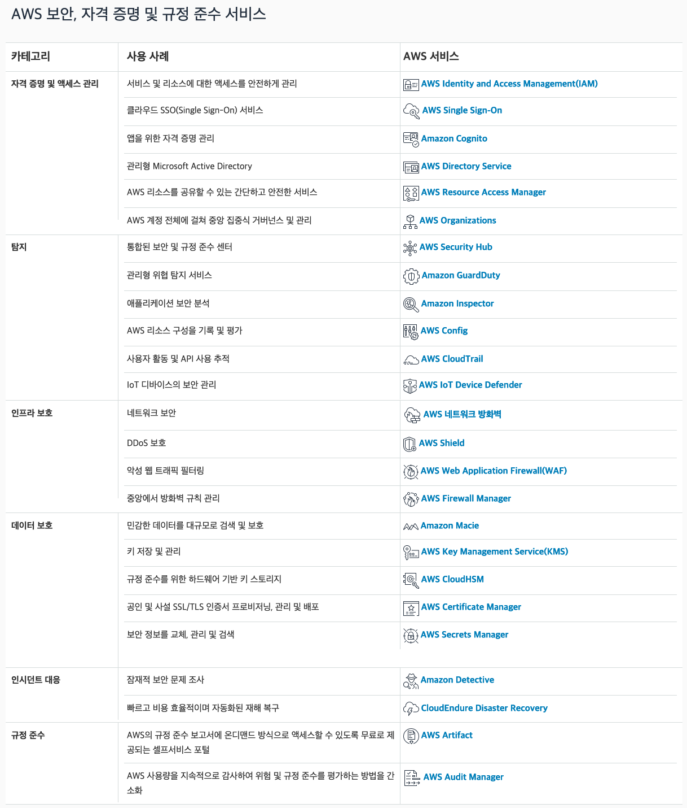

# 환영합니다

AWS 보안 및 규정 준수에 대한 일반적인 정보를 정리해 놓은 곳입니다. 이 내용은 AWS를 직접 대변하지 않으며, 한국 AWS 고객분들이 자주 문의하시는 내용을 쉽게 참고할 수 있도록 편의를 위해 정리해 놓은 사이트입니다. 

## What's new...
본 사이트에 새로 추가된 내용들은 다음과 같습니다.(2022년 9월 기준)

Blog 6 종 - [Store Amazon EMR in-transit data encryption certificates using AWS Secrets Manager](https://aws.amazon.com/blogs/big-data/store-amazon-emr-in-transit-data-encryption-certificates-using-aws-secrets-manager/),[Integrate AWS IAM Identity Center (successor to AWS Single Sign-On) with AWS Lake Formation fine-grained access controls](https://aws.amazon.com/blogs/big-data/integrate-aws-iam-identity-center-successor-to-aws-single-sign-on-with-aws-lake-formation-fine-grained-access-controls/),[Use ADFS OIDC as the IdP for an Amazon SageMaker Ground Truth private workforce](https://aws.amazon.com/blogs/machine-learning/use-adfs-oidc-as-the-idp-for-an-amazon-sagemaker-ground-truth-private-workforce/),[Build repeatable, secure, and extensible end-to-end machine learning workflows using Kubeflow on AWS](https://aws.amazon.com/blogs/machine-learning/build-repeatable-secure-and-extensible-end-to-end-machine-learning-workflows-using-kubeflow-on-aws/),[AWS co-announces release of the Open Cybersecurity Schema Framework (OCSF) project](https://aws.amazon.com/blogs/security/aws-co-announces-release-of-the-open-cybersecurity-schema-framework-ocsf-project/),[Introducing Amazon VPC Flow Logs to Kinesis Data Firehose](https://aws.amazon.com/blogs/networking-and-content-delivery/introducing-amazon-vpc-flow-logs-kinesis-data-firehose/)
* 워크샵 - [AWS Config 워크샵](https://catalog.us-east-1.prod.workshops.aws/workshops/6d057868-fd57-4029-a708-90f8b7f00388/ko-KR)
* Blog 5 종 - [Announcing new AWS IAM Identity Center APIs to manage users and groups at scale](https://aws.amazon.com/blogs/security/announcing-new-aws-iam-identity-center-apis-to-manage-users-and-groups-at-scale/),[Fine-grained entitlements in Amazon Redshift: A case study from TrustLogix](https://aws.amazon.com/blogs/big-data/fine-grained-entitlements-in-amazon-redshift-a-case-study-from-trustlogix/),[Announcing an update to IAM role trust policy behavior](https://aws.amazon.com/blogs/security/announcing-an-update-to-iam-role-trust-policy-behavior/),[Securely assess database schema migrations using AWS SCT, Amazon RDS for Oracle, and AWS Secrets Manager](https://aws.amazon.com/blogs/database/securely-assess-database-schema-migrations-using-aws-sct-amazon-rds-for-oracle-and-aws-secrets-manager/),[Secure media delivery at the edge on Amazon Web Services](https://aws.amazon.com/blogs/media/secure-media-delivery-at-the-edge-on-amazon-web-services/)

## Remarks

* 이 사이트의 모든 내용은 바뀌거나 수정될 수 있습니다.
* 공식적인 상세한 내용은 http://aws.amazon.com 의 내용을 참조하십시오.
* 제공되는 내용에 이견이 있거나 잘못된 링크를 발견하시면, 관리자(gisunlim@amazon.com)에게 메일을 주시면 대단히 감사하겠습니다.

---

[개인 정보 보호 정책](https://aws.amazon.com/privacy/?nc1=f_pr) | [사이트 이용 약관](https://aws.amazon.com/terms/?nc1=f_pr) | © 2021, Amazon Web Services, Inc. 또는 자회사. All rights reserved. 

