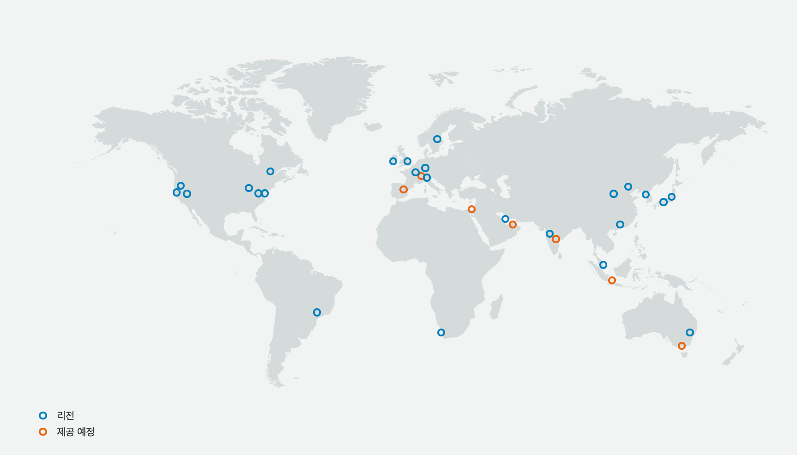

# AWS 클라우드 인프라

AWS 클라우드 자체의 인프라 및 인프라 보안과 관련된 정보들은 다음과 같습니다. 

## AWS 글로벌 인프라
[AWS 글로벌 인프라](https://aws.amazon.com/ko/about-aws/global-infrastructure/)(리전, 가용영역, 엣지)의 목록과 위치를 확인할 수 있는 싸이트 입니다. 계속해서 추가되는 AWS 글로벌 인프라의 최신 정보를 확인할 수 있습니다. 아래 목록은 현재 기준 AWS 리전들의 리스트입니다(Gov Cloud 제외).

* US East(Northern Virginia) : __IAD__ (us-east-1)
* US East(Ohio) : __CMH__ (us-east-2)  
* US West(Northern California) : __SFO__ (us-west-1) 
* US West(Oregon) : __PDX__ (us-west-2)
* Canada Montreal(Montreal) : __YUL__ (ca-central-1)
* South America(Sao Paulo) : __GRU__ (sa-east-1)
* EU(Ireland) : __DUB__ (eu-west-1)
* EU(London) : __LHR__ (eu-west-2)
* EU(Frankfurt) : __FRA__ (eu-central-1)
* EU(Paris) : __CDG__ (eu-west-3)
* EU(Stockholm) : __ARN__ (eu-north-1)
* EU(Milano) : __MXP__ (eu-south-1)
* Asia Pacific(Singapore) : __SIN__ (ap-southeast-1) 
* Asia Pacific(Tokyo) : __NRT__ (ap-northeast-1)
* Asia Pacific(Osaka) : __KIX__ (ap-northeast-3)
* Asia Pacific(Sydney) : __SYD__ (ap-southeast-2) 
* Asia Pacific(Seoul) : __ICN__ (ap-northeast-2)
* Asia Pacific(Mumbai) : __BOM__ (ap-south-1)
* Asia Pacific(Hong Kong) : __HKG__ (ap-east-1)
* China(Beijing) : __BJS__ (cn-north-1)
* China(Ningxia) : __ZHY__ (cn-northwest-1)
* MiddleEast(Bahrain) : __BAH__ (me-south-1)
* Africa(Cape Town) : __CPT__ (af-south-1)

### 엔드포인트
* [리전 엔드포인트](https://docs.aws.amazon.com/ko_kr/general/latest/gr/rande.html#regional-endpoints)
* [서비스 엔드포인트 보기](https://docs.aws.amazon.com/ko_kr/general/latest/gr/rande.html#view-service-endpoints)
* [서비스 엔드포인트 및 할당량](https://docs.aws.amazon.com/ko_kr/general/latest/gr/aws-service-information.html)
* [FIPS 엔드포인트](https://docs.aws.amazon.com/ko_kr/general/latest/gr/rande.html#FIPS-endpoints)

### AWS IP 주소
* [AWS IP 주소 범위](https://docs.aws.amazon.com/ko_kr/general/latest/gr/aws-ip-ranges.html)
* [ip-ranges.json 다운로드](https://docs.aws.amazon.com/ko_kr/general/latest/gr/aws-ip-ranges.html#aws-ip-download)
* [ip-ranges.json 구문](https://docs.aws.amazon.com/ko_kr/general/latest/gr/aws-ip-ranges.html#aws-ip-syntax)
* [ip-ranges.json 파일 필터링](https://docs.aws.amazon.com/ko_kr/general/latest/gr/aws-ip-ranges.html#filter-json-file)
* [ip-ranges.json 송신 제어 구현](https://docs.aws.amazon.com/ko_kr/general/latest/gr/aws-ip-ranges.html#aws-ip-egress-control)
* [AWS IP 주소 범위 알림](https://docs.aws.amazon.com/ko_kr/general/latest/gr/aws-ip-ranges.html#subscribe-notifications)

### AWS API 서명
* [AWS API 요청에 서명](https://docs.aws.amazon.com/ko_kr/general/latest/gr/signing_aws_api_requests.html)
* [서명 버전 4 서명 프로세스](https://docs.aws.amazon.com/ko_kr/general/latest/gr/signature-version-4.html)
* [서명 버전 4의 변경 사항](https://docs.aws.amazon.com/ko_kr/general/latest/gr/sigv4_changes.html)
* [AWS 서명 버전 4 요청의 요소](https://docs.aws.amazon.com/ko_kr/general/latest/gr/sigv4_elements.html)
* [서명 버전 4를 사용하여 AWS 요청에 서명](https://docs.aws.amazon.com/ko_kr/general/latest/gr/sigv4_signing.html)
* [서명 버전 4에 대한 서명 키 생성 방법을 보여주는 예](https://docs.aws.amazon.com/ko_kr/general/latest/gr/signature-v4-examples.html)
* [AWS 서명 버전 4 오류 문제 해결](https://docs.aws.amazon.com/ko_kr/general/latest/gr/signature-v4-troubleshooting.html)
* [서명 버전 4에 대한 서비스별 참조](https://docs.aws.amazon.com/ko_kr/general/latest/gr/reference-for-signature-version-4.html)
* [서명 버전 2 서명 과정](https://docs.aws.amazon.com/ko_kr/general/latest/gr/signature-version-2.html)

## AWS의 데이터 센터 제어
* [AWS의 제어](https://aws.amazon.com/ko/compliance/data-center/controls/) _– AWS의 데이터센터에 대한 보안설계, 비즈니스 연속성 및 재해복구, 물리적 엑세스, 모니터링 및 로깅, 감시 및 탐지, 디바이스 관리, 운영 지원, 인프라 유지 관리, 거버넌스 및 위험 등 다양한 항목들에 걸쳐서 보안 통제가 어떻게 적용되고 있는지를 안내하는 싸이트 입니다._

* [Uptime Institute 티어](https://aws.amazon.com/ko/compliance/uptimeinstitute/?nc1=h_ls) _- AWS의 데이터 센터가 Uptime Institute의 지침을 어느 정도로 수용하여 설계, 운용되고 있는지에 대한 내용을 안내하고 있는 싸이트_

## 스캐닝 및 침투 테스트
* [침투 테스트](https://aws.amazon.com/ko/security/penetration-testing/) _– AWS 상에서 운영중인 워크로드에 대한 스캐닝, 침투 테스트 등 각종 테스트 작업에 대한 허용 범위와 조건을 안내하는 싸이트 입니다._
* [권장 스캐너 AMI 목록](https://aws.amazon.com/marketplace/search/results?searchTerms=pre-authorized+scanning&page=1&ref_=nav_search_box) _- 유료_
* [PCI - Penetration Testing Guidance](https://www.pcisecuritystandards.org/documents/Penetration-Testing-Guidance-v1_1.pdf?agreement=true&time=1561081733779) _- v.1.1, 2017년 9월_

## AWS에 적용된 취약점 목록 확인
* [Latest Bulletins](https://aws.amazon.com/ko/security/security-bulletins/) _– AWS 플랫폼 전체에 적용된 보안 취약점 조치 내역을 확인할 수 있는 싸이트입니다._
* [취약성 보고하기](https://aws.amazon.com/ko/security/vulnerability-reporting/) _- 고객 쪽에서 새로 발견했거나 인지 및 의심하고 있는 취약점들에 대해 적극적으로 AWS쪽에 알려주실 수 있는 방법을 안내하고 있는 싸이트 입니다._
* [Amazon Linux Security Center](https://alas.aws.amazon.com/) _- Amazon Linux AMI에 적용된 최신 CVE 목록을 확인할 수 있는 싸이트._
* [AWS PGP Public Key](https://aws.amazon.com/security/aws-pgp-public-key/) _- aws-security@amazon.com과 암호화된 메일 커뮤니케이션을 할 때 필요한 AWS PGP 공개키_ 
* [Apache Log4j2 Issue (CVE-2021-44228)](https://aws.amazon.com/security/security-bulletins/AWS-2021-005/)
* [Update for Apache Log4j2 Issue (CVE-2021-44228)](https://aws.amazon.com/security/security-bulletins/AWS-2021-006/)

## Remarks

* 이 사이트의 모든 내용은 바뀌거나 수정될 수 있습니다.
* 공식적인 상세한 내용은 http://aws.amazon.com 의 내용을 참조하십시오.
* 제공되는 내용에 이견이 있거나 잘못된 링크를 발견하시면, 관리자(gisunlim@amazon.com)에게 메일을 주시면 대단히 감사하겠습니다.

---

[개인 정보 보호 정책](https://aws.amazon.com/privacy/?nc1=f_pr) | [사이트 이용 약관](https://aws.amazon.com/terms/?nc1=f_pr) | © 2020, Amazon Web Services, Inc. 또는 자회사. All rights reserved. 

