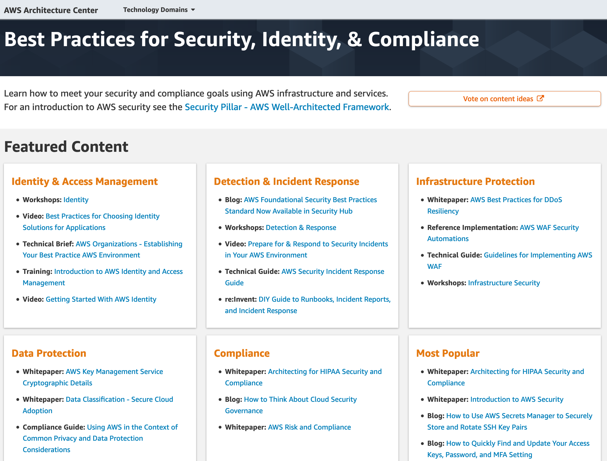

# AWS 보안 관련 교육, 블로그, 백서

AWS 보안 및 규정 준수와 관련된 교육과정, 보안 블로그, 보안 백서 등의 정보는 다음과 같습니다. 

## AWS Security 교육과정 안내
AWS Security에 대한 온/오프라인 교육과정들입니다.

* [AWS Security Learning Path](https://aws.amazon.com/training/path-security/) _- 온/오프라인 교육과정 안내_
* [Getting Started with AWS Security, Identity, and Compliance (Korean) (3 hours)](https://www.aws.training/Details/eLearning?id=65258) _- Online, 무료_
* [AWS Shared Responsibility Model (Korean) (5 minutes)](https://www.aws.training/Details/Video?id=67680) _- Online, 무료_
* [AWS Cloud Practitioner Essentials (Second Edition): AWS Security (Korean) (50 minutes)](https://www.aws.training/Details/eLearning?id=32450) _- Online, 무료_
* [Introduction to AWS Identity and Access Management (10 minutes)](https://www.aws.training/learningobject/video?id=16448) _– Online, 무료_
* [Authentication and Authorization with AWS Identity and Access Management (Korean) (15 minutes)](https://www.aws.training/Details/Video?id=65265) _- Online, 무료_
* [Introduction to AWS Security Token Services (STS) (20 minutes)](https://www.aws.training/learningobject/video?id=15877) _- Online, 무료_
* [Introduction to Amazon Cloud Directory (10 minutes)](https://www.aws.training/learningobject/video?id=16379) _– Online, 무료_
* [Introduction to Amazon Macie (10 minutes)](https://www.aws.training/learningobject/video?id=16455) _– Online, 무료_
* [Introduction to Data Encryption (5 minutes)](https://www.aws.training/learningobject/video?id=16482) _- Online, 무료_
* [Introduction to AWS Artifact (10 minutes)](https://www.aws.training/learningobject/video?id=15872) _– Online, 무료_
* [Introduction to Amazon Inspector (15 minutes)](https://www.aws.training/learningobject/video?id=15879) _– Online, 무료_
* [Introduction to AWS Organizations (10 minutes)](https://www.aws.training/learningobject/video?id=16451) _– Online, 무료_
* [Introduction to Amazon Certificate Manager Private Certificate Authority (15 minutes)](https://www.aws.training/Details/Video?id=54775) _– Online, 무료_
* [Protecting Your Instance with Security Groups (Korean) (10 minutes)](https://www.aws.training/learningobject/video?id=16487) _- Online, 무료_
* [Differences Between Security Groups and NACLs (Korean) (10 minutes)](https://www.aws.training/Details/Video?id=54774) _- Online, 무료_
* [Understanding Amazon EBS Volume Encryption (Korean) (2 minutes)](https://www.aws.training/Details/Video?id=54776) _- Online, 무료_
* [Deep Dive on Container Security (Korean) (30 minutes)](https://www.aws.training/Details/Video?id=67681) _- Online, 무료_
* [Using a Token-based Approach to Build Highly Secure, Stateless, and Decoupled Applications (30 minutes)](https://www.aws.training/learningobject/video?id=26842) _- Online, 무료_
* [Introduction to AWS CloudTrail (Korean) (10 minutes)](https://www.aws.training/Details/Video?id=65784) _- Online, 무료_
* [Introduction to Amazon CloudWatch (10 minutes)](https://www.aws.training/learningobject/video?id=16390) _- Online, 무료_
* [Introduction to Amazon CloudWatch Logs (10 minutes)](https://www.aws.training/learningobject/video?id=16391) _- Online, 무료_
* [Introduction to Amazon CloudWatch Logs Insights (10 minutes)](https://www.aws.training/learningobject/video?id=27171) _- Online, 무료_
* [Introduction to AWS Service Catalog (10 minutes)](https://www.aws.training/learningobject/video?id=16497) _- Online, 무료_
* [Introduction to AWS Trusted Advisor (10 minutes)](https://www.aws.training/learningobject/video?id=16377) _- Online, 무료_
* [Introduction to AWS Config (Korean) (10 minutes)](https://www.aws.training/Details/Video?id=65260) _- Online, 무료_
* [Introduction to AWS CloudFormation (Korean) (10 minutes)](https://www.aws.training/Details/Video?id=65775) _- Online, 무료_
* [Introduction to Amazon Virtual Private Cloud (VPC) (10 minutes)](https://www.aws.training/learningobject/video?id=15884) _- Online, 무료_
* [Protect Your Web-facing Workloads with AWS Security Services (40 minutes)](https://www.aws.training/Details/Video?id=27496) _- Online, 무료_
* [AWS Security Fundamentals (Korean) (4 hours)](https://www.aws.training/Details/Curriculum?id=11048) _– Online, 무료_
* [Security Operations on AWS (3 days)](https://aws.amazon.com/ko/training/course-descriptions/security-operations/?nc1=h_ls) _– Offline, Instructor-led, 유료_
* [AWS Fundamentals: Addressing Security Risk(4주간 진행, 전체 18시간 소요](https://www.coursera.org/learn/aws-fundamentals-addressing-security-risk) _- OnLine, 무료_
* [Exam Readiness: AWS Certified Security - Specialty (2 Hrs)](https://www.aws.training/Details/eLearning?id=34786) _- OnLine, 무료_
* [Configure and Deploy AWS Client VPN (30 minutes)](https://www.aws.training/Details/eLearning?id=49725) _- OnLine, 무료_
* [Configure and Deploy Amazon PrivateLink (60 minutes)](https://www.aws.training/Details/eLearning?id=54077) _- Online, 무료_
* [Machine Learning Security (Korean, 150 minutes)](https://www.aws.training/Details/Curriculum?id=54770) _- Online, 무료_
* [AWS Identity and Access Management - Architecture and Terminology (15 minutes)](https://www.aws.training/Details/eLearning?id=55148) _- Online, 무료_
* [AWS Identity and Access Management - Basics (15 minutes)](https://www.aws.training/Details/eLearning?id=54606) _- Online, 무료_ 
* [AWS Foundations: Securing Your AWS Cloud (Korean) (50 minutes)](https://www.aws.training/Details/Video?id=67679) _- Online, 무료_ 
* [AWS IoT Security Series (10 hours)](https://www.aws.training/Details/Curriculum?id=43468) _- Online, 무료_ 
* [Deep Dive into AWS IoT Authentication and Authorization (4 hours)](https://www.aws.training/Details/Curriculum?id=42335) _- Online, 무료_
* [AWS IoT Device Defender Primer (3 hours)](https://www.aws.training/Details/Curriculum?id=42108) _- Online, 무료_
* [Cloud Audit Academy (3 hours)](https://www.aws.training/Details/eLearning?id=41556) _- Online, 무료_
* [CQ: The AWS Certification Quiz Show | Sydney Summit E04 (15 minutes)](https://www.aws.training/Details/Video?id=37283) _- Online, 무료_
* [CQ: The AWS Certification Quiz Show | Sydney Summit E05 (15 minutes)](https://www.aws.training/Details/Video?id=37284) _- Online, 무료_
* [CQ: The AWS Certification Quiz Show | Episode 06 (30 minutes)](https://www.aws.training/Details/Video?id=37293) _- Online, 무료_
* [AWS Lambda Function Security & Defense in Depth (20 minutes)](https://www.aws.training/Details/Video?id=27498) _- Online, 무료_
* [Deep Dive with Security: AWS Identity and Access Management (IAM)(8 hours)](https://www.aws.training/Details/eLearning?id=53780) _- OnLine, 유료_
* [Improve Code Quality with Amazon CodeGuru Reviewer(1 Hour)](https://www.aws.training/Details/eLearning?id=73961) _- Online, 무료_
* [Amazon Simple Storage Service (Amazon S3) Business Continuity and Disaster Recovery(50 minutes)](https://www.aws.training/Details/eLearning?id=78563) _- Online, 무료_
* [Security Governance at Scale – Technical(4 hours)](https://www.aws.training/Details/eLearning?id=79259) _- OnLine, 무료_
* [Cybersecurity Awareness program](https://learnsecurity.amazon.com/training/story.html) _- Online, 무료_
* [Cloud Audit Academy(3 Hrs)](https://aws.amazon.com/ko/compliance/auditor-learning-path/) _- Online, 무료_

## AWS 보안 모범사례
* [Best Practices for Security, Identity, & Compliance](https://aws.amazon.com/ko/architecture/security-identity-compliance/)
AWS Well-Architected Framework - Security Pillar에 의거하여 고객분들이 참조할 수 있는 보안 모범사례와 관련된 다양한 컨텐츠, 동영상, 레퍼런스 아키텍쳐, 솔루션, 디자인 패턴, 블로그들을 소개하고 있는 사이트입니다.

## AWS 보안 블로그
* [AWS 보안 블로그](https://aws.amazon.com/blogs/security/) _- AWS보안 서비스들의 최신 기능에 대한 소개, 신규 보안 백서, 보안 파트너 제품들과의 연동 등 다양한 주제로 고객들이 AWS를 보다 안전하게 이용할 수 있는 정보들을 제공하고 있습니다._

## AWS 보안 및 규정준수 백서
클라우드 보안 및 규정 준수 관련 AWS가 제공하는 백서 및 외부 백서 목록입니다.

### 보안 백서
* 영문 - [Introduction to AWS Security](https://docs.aws.amazon.com/whitepapers/latest/introduction-aws-security/welcome.html) _-2021년 11월 11일_
* 영문 – [AWS Well Architected Framework Security Pillar](https://docs.aws.amazon.com/wellarchitected/latest/security-pillar/wellarchitected-security-pillar.pdf) _-2020년 7월_
* 한글 – [대규모 보안: AWS에서 로깅하기](https://d0.awsstatic.com/International/ko_KR/whitepapers/Compliance/AWS_Security_at_Scale_Logging_in_AWS_Whitepaper.pdf) _- 2015년 10월_
* 한글 – [대규모 보안: AWS기반 거버넌스](http://d0.awsstatic.com/International/ko_KR/whitepapers/Compliance/AWS_Security_at_Scale_Governance_in_AWS_Whitepaper.pdf) _- 2015년 10월_
* 영문 - [AWS Governance at Scale](https://docs.aws.amazon.com/aws-technical-content/latest/aws-governance-at-scale/introduction.html) _- 2018년 11월_
* 한글 – [AWS 보안 모범 사례](https://d1.awsstatic.com/whitepapers/Security/KO_Whitepapers/AWS_Security_Best_Practices_KO.pdf) _- 2016년 8월_
* 한글 – [AWS Security by Design 소개](http://d0.awsstatic.com/International/ko_KR/whitepapers/Compliance/Intro_to_Security_by_Design.pdf) _- 2015년 10월_
* 영문 – [Amazon Web Services: Overview of SecurityProcesses](https://docs.aws.amazon.com/whitepapers/latest/aws-overview-security-processes/aws-overview-security-processes.pdf) _- 2020년 3월_
* 영문 - [Overview of AWS Security - Analytics, Mobile, and Application Services](https://d1.awsstatic.com/whitepapers/Security/Security_Analytics_Mobile_Services_Applications_Whitepaper.pdf) _- 2016년 6월_
* 영문 - [Overview of AWS Security - Application Services](https://d1.awsstatic.com/whitepapers/Security/Security_Application_Services_Whitepaper.pdf) _- 2016년 6월_ Archived
* 영문 - [Overview of AWS Security - Compute Services](https://d1.awsstatic.com/whitepapers/Security/Security_Compute_Services_Whitepaper.pdf) _- 2016년 6월_ Archived
* 영문 - [Overview of AWS Security - Database Services](https://d1.awsstatic.com/whitepapers/Security/Security_Database_Services_Whitepaper.pdf) _- 2016년 6월_ Archived
* 영문 - [Overview of AWS Security - Network Services](https://d1.awsstatic.com/whitepapers/Security/Networking_Security_Whitepaper.pdf) _- 2016년 8월_ Archived
* 영문 - [Overview of AWS Security - Storage Services](https://d1.awsstatic.com/whitepapers/Security/Security_Storage_Services_Whitepaper.pdf) _- 2016년 6월_ Archived
* 영문 - [AWS Governance at Scale](https://d1.awsstatic.com/whitepapers/Security/AWS_Governance_at_Scale.pdf) _- 2018년 11월_
* 영문 – [CIS AWS Foundation](https://www.cisecurity.org/benchmark/amazon_web_services/) _- v.1.2, 2018년 5월_
* 영문 – [CIS Amazon Web Services Three-tier Web](https://d0.awsstatic.com/whitepapers/compliance/CIS_Amazon_Web_Services_Three-tier_Web_Architecture_Benchmark.pdf) _- v.1.0, 2016년 11월_
* 영문 - [Logical Separation on AWS](https://d1.awsstatic.com/whitepapers/compliance/AWS_Logical_Separation_Handbook.pdf) _- 2020년 7월_
* 한글 – [디도스 대응을 위한 AWS 모범사례](https://d0.awsstatic.com/International/ko_KR/whitepapers/DDoS_White_Paper.pdf) _- 2016년 6월_
* 영문 - [AWS Best Practices for DDoS Resiliency](https://d1.awsstatic.com/whitepapers/Security/DDoS_White_Paper.pdf) _- 2021년 9월 21일, 상기 한글버전의 최신 영문판_
* 한글 – [AWS WAF를 활용한 OWASP Top10 웹 애플리케이션 취약점 보완 방법](https://d2908q01vomqb2.cloudfront.net/7b52009b64fd0a2a49e6d8a939753077792b0554/2017/08/15/aws-waf-owasp-ko.pdf) _- 2017년 7월_
* 영문 - [Building a Secure, Approved AMI Factory Process Using Amazon EC2 Systems Manager (SSM), AWS Marketplace, and AWS Service Catalog](https://d1.awsstatic.com/whitepapers/aws-building-ami-factory-process-using-ec2-ssm-marketplace-and-service-catalog.pdf) _- 2017년 11월_
* 영문 - [Single Sign-On: Integrating AWS, OpenLDAP, and Shibboleth](http://d0.awsstatic.com/whitepapers/aws-whitepaper-single-sign-on-integrating-aws-open-ldap-and-shibboleth.pdf) _- 2015년 4월_
* 한글 - [저장 데이터 암호화](https://d0.awsstatic.com/International/ko_KR/whitepapers/Compliance/AWS_Securing_Data_at_Rest_with_Encryption.pdf) _- 2014년 11월_
* 영문 - [AWS Key Management Service Best Practices](https://d0.awsstatic.com/whitepapers/aws-kms-best-practices.pdf) _- 2017년 4월_
* 영문 - [Security of AWS CloudHSM backups](https://d1.awsstatic.com/whitepapers/Security/security-of-aws-cloudhsm-backups.pdf) _- 2020년 4월_
* 영문 - [Secure Content Delivery with CloudFront](https://d1.awsstatic.com/whitepapers/Security/Secure_content_delivery_with_CloudFront_whitepaper.pdf) _- 2016년 11월_ Archived
* 영문 - [Security Overview of AWS Lambda](https://d1.awsstatic.com/whitepapers/Overview-AWS-Lambda-Security.pdf) _- 2019년 3월_ Archived
* 영문 - [The 12 Most Critical Risks for Serverless Applications 2019 Guide](https://www.puresec.io/blog/the-12-most-critical-risks-for-serverless-applications-2019-guide) _- PureSec과 CSA가 공동으로 제작한 서버리스 환경의 보안 리스크 관련 백서_
* 영문 - [Securing Internet of Things(IoT) with AWS](https://d1.awsstatic.com/whitepapers/Security/Securing_IoT_with_AWS.pdf) _- 2019년 4월_
* 영문 - [AWS Security Incidence Response Guide](https://d1.awsstatic.com/whitepapers/aws_security_incident_response.pdf) _- 2020년 6월_
* 영문 - [Securely Access Services Over AWS PrivateLink](https://d1.awsstatic.com/whitepapers/aws-privatelink.pdf) _- 2021년 6월_3일
* 영문 - [Securing the Microsoft Platform on Amazon Web Services](https://d1.awsstatic.com/whitepapers/aws-microsoft-platform-security.pdf) _- 2019년 8월_
* 영문 - [Active Directory Domain Services on AWS](https://d1.awsstatic.com/whitepapers/adds-on-aws.pdf) _- 2020년 11월_
* 영문 - [Encrypting File Data with Amazon Elastic File System](https://docs.aws.amazon.com/whitepapers/latest/efs-encrypted-file-systems/efs-encrypted-file-systems.html) _- 2021년 2월 22일_
* 영문 - [Amazon Virtual Private Cloud Connectivity Options](https://d1.awsstatic.com/whitepapers/aws-amazon-vpc-connectivity-options.pdf) _- 2018년 1월_
* 영문 - [Building a Scalable and Secure Multi-VPC AWS Network Infrastructure](https://d1.awsstatic.com/whitepapers/building-a-scalable-and-secure-multi-vpc-aws-network-infrastructure.pdf) _- 2020년 6월_
* 영문 - [NSA - Mitigating Cloud Vulnerabilities](https://media.defense.gov/2020/Jan/22/2002237484/-1/-1/0/CSI-MITIGATING-CLOUD-VULNERABILITIES_20200121.PDF) 
_- 2020년 1월_
* 영문 - [Guidelines for Implementing AWS WAF](https://d1.awsstatic.com/whitepapers/guidelines-implementing-aws-waf.pdf) _- 2020년 5월_
* 외부논문 - [Backstabber’s Knife Collection: A Review of Open Source Software Supply Chain Attacks](https://arxiv.org/pdf/2005.09535.pdf) _- 2020년 5월, 174개의 악성 SW 패키지들에 대한 조사_
* 외부논문 - [CDN Backfired: Amplification Attacks Based on HTTP Range Requests](https://www.liubaojun.org/uploads/1/1/8/3/118316462/dsn_2020.pdf)
* 외부백서 - [AWS Security Maturity Roadmap](https://summitroute.com/downloads/aws_security_maturity_roadmap-Summit_Route.pdf) _- 2020년 5월_
* 영문 - [Security of AWS CloudHSMBackups](https://d1.awsstatic.com/whitepapers/Security/security-of-aws-cloudhsm-backups.pdf) _- 2021년 3월 24일_
* 영문 - [Migrating to AWS CloudHSM](http://s3.amazonaws.com/cloudhsmv2-software/CloudHsmClient/Docs/CloudHSMUpgradeGuide-latest.pdf) _- 2019년 2월_
* 영문 - [AWS Shield Threat Landscape Report –Q1.2020](https://aws-shield-tlr.s3.amazonaws.com/2020-Q1_AWS_Shield_TLR.pdf) _- 2020년 5월_
* 영문 - [Open Banking on AWS](https://d1.awsstatic.com/architecture-diagrams/ArchitectureDiagrams/open-banking-on-aws.pdf) _- 2019년_
* 영문 - [Reference Architecture - Secure Cloud Computing Architecture (SCCA) on AWS GovCloud](https://d1.awsstatic.com/architecture-diagrams/ArchitectureDiagrams/dod-scca-multiaccount-ra.pdf) _- 2020년 6월_
* 영문 - [AWS Security Checklist](https://d1.awsstatic.com/whitepapers/Security/AWS_Security_Checklist.pdf?did=wp_card&trk=wp_card) _- 2020년 7월_
* 영문 - [OREGENIX - Amazon GuardDuty Security Review](https://d1.awsstatic.com/certifications/foregenix_amazon_guardduty_security_review_07-2020.pdf) _- 2020년 7월_
* 영문 - [Securing your  AWS Cloud environment from ransomware](https://d1.awsstatic.com/WWPS/pdf/AWSPS_ransomware_ebook_Apr-2020.pdf) _- 2020년 4월_
* 영문 - [Lab instrument log acquisition and analytics](https://d1.awsstatic.com/architecture-diagrams/ArchitectureDiagrams/lab-instruments-log-analytics-ra.pdf) _- 2020년 11월_
* 영문 - [Security Overview of Amazon API Gateway](https://d1.awsstatic.com/whitepapers/api-gateway-security.pdf) _- 2020년 11월_
* 외부 백서 영문 - [Kubernetes Security White Papaer](https://github.com/kubernetes/community/blob/master/sig-security/security-audit-2019/findings/Kubernetes%20White%20Paper.pdf) _- 2019년 6월 17일_
* 영문 - [Access Amazon WorkSpaces with Common Access Cards](https://docs-aws.amazon.com/whitepapers/latest/access-workspaces-with-access-cards/access-workspaces-with-access-cards.html) _- 2021년 3월 8일_
* 영문 - [Classic Intrusion Analysis Frameworks for AWS Environments: Application and Enhancement](https://docs.aws.amazon.com/whitepapers/latest/classic-intrusion-analysis-frameworks-for-aws-environments/classic-intrusion-analysis-frameworks-for-aws-environments.html) _- 2021년 3월 31일_
* 영문 - [Carrier-Grade Mobile Packet Core Network on AWS](https://d1.awsstatic.com/whitepapers/carrier-grade-mobile-packet-core-network-on-aws.pdf) _- 2021년 3월 11일_
* 영문 - [AWS Security Reference Architecture (AWS SRA) - AWS Prescriptive Guidance](https://docs.aws.amazon.com/prescriptive-guidance/latest/security-reference-architecture/welcome.html) _- 2021년 6월_
* 영문 - [Organizing Your AWS Environment Using Multiple Accounts](https://docs.aws.amazon.com/whitepapers/latest/organizing-your-aws-environment/organizing-your-aws-environment.html) _- 2022년 7월 26일_
* 영문 - [Building an AWS Perimeter](https://d1.awsstatic.com/whitepapers/building_an_aws_perimeter.pdf) _- 2021년 9월 8일_
* 영문 - [Ransomware Risk Management on AWS Using the NIST Cyber Security Framework (CSF)](https://d1.awsstatic.com/whitepapers/Security/ransomware-risk-management-on-aws-using-csf.pdf) _- 2021년 8월 30일_
* 영문 - [Introducing the Security at the Edge: Core Principles whitepaper](https://aws.amazon.com/ko/blogs/security/introducing-the-security-at-the-edge-core-principles-whitepaper/)
* 영문 - [An Overview of the AWS Cloud Adoption Framework](https://docs.aws.amazon.com/whitepapers/latest/overview-aws-cloud-adoption-framework/welcome.html) _- 2021년 11월 22일_
* 영문 - [Security Best Practices for Manufacturing OT](https://d1.awsstatic.com/whitepapers/security-bp-for-manufacturing-ot.pdf) _- 2021년 5월 20일_
* 영문(외부) - [Ransomware resilience on Amazon Web Services: Balancing security and recovery strategies](https://www2.deloitte.com/content/dam/Deloitte/us/Documents/risk/us-risk-aws-ransomware-resiliency-whitepaper.pdf) _- 2022년 7월_

### 규정 및 컴플라이언스
* 한글 – [AWS 사용 감사에 대한 소개](http://d0.awsstatic.com/International/ko_KR/whitepapers/Compliance/AWS_Auditing_Security_Checklist.pdf) _- 2015년 10월_
* 영문 - [AWS 규정 준수 빠른 참조 안내서](https://d1.awsstatic.com/whitepapers/compliance/AWS_Compliance_Quick_Reference.pdf) _- 2021년_
* 영문 - [AWS 규정 준수 빠른 참조 안내서: 교육 버전](https://d1.awsstatic.com/whitepapers/compliance/AWS_Compliance_Quick_Reference_Education.pdf) _- 2018년 3월_
* 영문 - [AWS 위험 및 규정 준수 개요](https://d1.awsstatic.com/whitepapers/compliance/AWS_Risk_and_Compliance_Overview.pdf) _- 2017년 1월_ Archived
* 영문 - [Amazon Web Services: Risk and Compliance](https://docs.aws.amazon.com/whitepapers/latest/aws-risk-and-compliance/welcome.html) _- 2021년 3월 11일_
* 한글 - [AWS 위험 및 규정 준수](https://d1.awsstatic.com/International/ko_KR/whitepapers/AWS_Risk_Compliance_Whitepaper_Aug_2015.pdf) _- 2015년 8월,(상기 영문버전의 이전 버전 번역본)_ Archived
* 영문 - [Automating Governance on AWS](https://d1.awsstatic.com/whitepapers/compliance/Automating_Governance_on_AWS.pdf) _- 2015년 8월_
* 영문 - [AWS Answers to Key Compliance Questions](https://d1.awsstatic.com/whitepapers/compliance/AWS_Answers_to_Key_Compliance_Questions.pdf) _-2017년 1월_ Archived
* 영문 - [AWS Certifications, Programs, Reports, and Third-Party Attestations](https://d1.awsstatic.com/whitepapers/compliance/AWS_Certifications_Programs_Reports_Third-Party_Attestations.pdf) _- 2017년 3월_ Archived
* 영문 - [Data Residency - AWS Policy Perspectives](https://d1.awsstatic.com/whitepapers/compliance/Data_Residency_Whitepaper.pdf) _- 2020년 8월_
* 영문 - [Executive Summary Data Residency - AWS Policy Perspectives](https://d1.awsstatic.com/whitepapers/compliance/Data_Residency_Executive_Summary.pdf) _- 2018년 2월, 상기 백서의 요약본_
* 한글 - [개인정보 취급 및 데이터 보호의 공통 고려사항 맥락에서의 AWS 사용](https://d1.awsstatic.com/whitepapers/compliance/KO_Whitepapers/Using_AWS_in_the_context_of_Common_Privacy_and_Data_Protection_Considerations_KO.pdf) _- 2018년 5월, AWS를 사용하여 개인정보가 포함된 콘텐츠를 저장하거나 처리하려고 할때 개인정보 취급 및 데이터 보호에 관한 공통적인 고려사항을 제공_
* 영문 - [Using AWS in the Context of Australian Privacy Considerations](https://d1.awsstatic.com/whitepapers/compliance/Using_AWS_in_the_context_of_Australian_Privacy_Considerations.pdf) _- 2020년 7월_
* 영문 - [Using AWS in the Context of Hong Kong Privacy Considerations](https://d1.awsstatic.com/whitepapers/compliance/Using_AWS_in_the_context_of_Hong_Kong_Privacy_Considerations.pdf) _- 2018년 5월_
* 영문 - [Using AWS in the Context of Malaysian Privacy Considerations](https://d1.awsstatic.com/whitepapers/compliance/Using_AWS_in_the_context_of_Malaysian_Privacy_Considerations.pdf) _- 2018년 5월_
* 영문 - [Using AWS in the Context of Japan Privacy Considerations](https://d1.awsstatic.com/whitepapers/compliance/Using_AWS_in_the_context_of_Japanese_Privacy_Considerations.pdf) _- 2018년 5월_
* 영문 - [Using AWS in the Context of New Zealand Privacy Considerations](https://d1.awsstatic.com/whitepapers/compliance/Using_AWS_in_the_context_of_New_Zealand_Privacy_Considerations.pdf) _- 2021년 4월_
* 영문 - [Using AWS in the Context of Singapore Privacy Considerations](https://d1.awsstatic.com/whitepapers/compliance/Using_AWS_in_the_context_of_Singapore_Privacy_Considerations.pdf) _- 2018년 5월_
* 영문 - [Using AWS in the Context of Philippines Privacy Considerations](https://d1.awsstatic.com/whitepapers/compliance/Using_AWS_in_the_context_of_Philippines_Privacy_Considerations.pdf) _- 2018년 5월_
* 영문 - [Using AWS in the Context of South African Privacy Considerations](https://d1.awsstatic.com/whitepapers/compliance/Using_AWS_in_the_Context_of_South_African_Privacy_Considerations.pdf) _- 2019년 7월_
* 영문 - [Introduction to Auditing the Use of AWS](https://d1.awsstatic.com/whitepapers/compliance/AWS_Auditing_Security_Checklist.pdf) _- 2015년 10월_ Archived
* 영문 - [Regulation Systems Compliance and Integrity Considerations for the AWS Cloud](https://d1.awsstatic.com/whitepapers/compliance/Regulation_Systems_Compliance_and_Integrity_Considerations.pdf) _- 2017년 11월_
* 영문 - [Data Classification - Secure Cloud Adoption](https://d1.awsstatic.com/whitepapers/compliance/AWS_Data_Classification.pdf) _- 2018년 6월_
* 영문 - [CSA Consensus Assessments Initiative Questionnaire](https://d1.awsstatic.com/whitepapers/compliance/CSA_Consensus_Assessments_Initiative_Questionnaire.pdf) _- 2017년 5월_
* 영문 - [NIST Cybersecurity Framework (CSF)](https://d1.awsstatic.com/whitepapers/compliance/NIST_Cybersecurity_Framework_CSF.pdf) _- 2019년 1월_
* 영문 - [AWS Response to CACP Information and Communication Technology Sub-Committee](https://d1.awsstatic.com/whitepapers/compliance/AWS_Response_to_CACP_Information_Storage_Requirements.pdf) _- 2017년 5월_
* 영문 - [Guidance for Trusted Internet Connection (TIC) Readiness on AWS](https://d1.awsstatic.com/whitepapers/compliance/Guidance_for_Trusted_Internet_Connection_TIC_Readiness_on_AWS.pdf) _- 2016년 2월_
* 영문 - [Secure Network Connections : An evaluation of the US Trusted Internet Connection (TIC) Program](https://d0.awsstatic.com/whitepapers/compliance/AWS_Secure_Network_Connections.pdf) _- 2017년 8월_
* 영문 - [MPAA Content Security : Model](https://d1.awsstatic.com/whitepapers/compliance/AWS_Alignment_with_Motion_Picture_of_America_Association_Application_and_Cloud.pdf) _- 2015년 3월_
* 영문 - [MPAA Content Security : Best Practices](https://d0.awsstatic.com/whitepapers/compliance/AWS_MPAA_2015_New_Best_Practices.pdf) _- 2015년 4월_
* 영문 - [Architecting for HIPAA Security and Compliance on Amazon Web Services](https://docs.aws.amazon.com/whitepapers/latest/architecting-hipaa-security-and-compliance-on-aws/welcome.html) _- 2021년 12월 6일_
* 영문 - [Architecting for Genomic Data Security and Compliance in AWS](https://d0.awsstatic.com/whitepapers/compliance/AWS_dBGaP_Genomics_on_AWS_Best_Practices.pdf) _- 2014년 12월_
* 영문 - [Considerations for Using AWS Products in GxP Systems](https://d1.awsstatic.com/whitepapers/compliance/Using_AWS_in_GxP_Systems.pdf) _- 2016년 1월_
* 한글 - [GxP 시스템에 따른 AWS 제품 사용지침](https://d1.awsstatic.com/whitepapers/compliance/KO_Whitepapers/Using_AWS_in_GxP_Systems_KO.pdf) _- 2016년 1월, 상기 백서의 한글 번역본_
* 영문 - [GxP Systems on AWS](https://d1.awsstatic.com/whitepapers/compliance/Using_AWS_in_GxP_Systems.pdf) _- 2021년 3월_
* 영문 - [GxP Compliance Automation](https://d1.awsstatic.com/architecture-diagrams/ArchitectureDiagrams/gxp_compliance_automation_ra.pdf) _- 2019년 11월, Reference Architecture_
* 영문 - [Amazon Web Services’ Approach to Operational Resilience in the Financial Sector & Beyond](https://d1.awsstatic.com/whitepapers/compliance/AWS_Operational_Resilience.pdf) _- 2021년 4월, 금융권의 신속한 서비스 복원 요건에 대해 AWS 환경에서의 가이드를 제공하는 백서_
* 영문 - [Federal Financial Institutions Examination Council (FFIEC) Audit Guide](https://d1.awsstatic.com/whitepapers/compliance/FFIEC_Audit_Guide.pdf) _- 2015년 10월_
* 한글 - [Amazon Web Services에 대한 FFIEC 규정 준수](https://d1.awsstatic.com/International/ko_KR/whitepapers/Compliance/AWS_Coalfire_FFIEC_Audit_Compliance_Workbook.pdf) _- 2015년 3월, 상기 백서의 한글 번역본_
* 영문 - [U.S. Securities and Exchange Commission’s (SEC) Office of Compliance Inspections and Examinations (OCIE) Cybersecurity Initiative Audit Guide](https://d1.awsstatic.com/whitepapers/compliance/AWS_SEC_Cybersecurity_Guide.pdf) _- 2015년 10월_
* 영문 - [AWS User Guide to Financial Services Regulations & Guidelines in Hong Kong - Insurance Authority](https://d1.awsstatic.com/whitepapers/hong-kong-insurance-authority-financial-regulations-guidelines.pdf) _- 2017년 10월_
* 영문 - [AWS User Guide to the Hong Kong Insurance Authority on Outsourcing and Use of Internet for Insurance Activities Guidelines](https://d1.awsstatic.com/whitepapers/hong-kong-insurance-authority-financial-regulations-guidelines.pdf) _- 2020년 4월_
* 영문 - [AWS User Guide to the Hong Kong Monetary Authority on Outsourcing and General Principles for Technology Risk Management Supervisory Policy Manuals](https://d1.awsstatic.com/whitepapers/compliance/HKMA_User_Guide.pdf) _- 2020년 4월_
* 영문 - [AWS User Guide to Financial Services Regulations & Guidelines in Hong Kong - Monetary Authority](https://d1.awsstatic.com/whitepapers/compliance/HKMA_User_Guide.pdf) _- 2020년 4월_
* 영문 - [AWS User Guide to Financial Services Regulations & Guidelines in Singapore](https://d1.awsstatic.com/whitepapers/compliance/Financial_Services_Regulations_Guidelines_in_Singapore.pdf) _- 2019년 5월_
* 영문 - [AWS User Guide for U.S. Financial Institutions](https://d1.awsstatic.com/whitepapers/compliance/AWS_User_Guide_for_Financial_Services_in_the_United_States.pdf) _- 2018년 10월_
* 영문 - [AWS User Guide to Financial Services Regulations & Guidelinesin Australia](https://d1.awsstatic.com/whitepapers/compliance/AWS_User_Guide_to_Financial_Services_Regulations_and_Guidelines_in_Australia.pdf) _- 2020년 7월_
* 영문 - [AWS User Guide to Financial Services Regulations in Brazil – Brazilian National Monetary Council, Resolution 4,658](https://d1.awsstatic.com/whitepapers/compliance/AWS_User_Guide_for_Financial_Services_in_Brazil.pdf) _- 2018년 7월_
* 영문 - [AWS User Guide to Banking Regulations & Guidelines in India](https://d1.awsstatic.com/whitepapers/compliance/AWS_User_Guide_for_Banks_in_India.pdf) _- 2017년 12월_
* 한글 - [액센츄어 AWS 보안 프레임워크: 싱가포르 통화청 지침](https://d1.awsstatic.com/whitepapers/compliance/KO_Whitepapers/Accenture_AWS_Security_Framework_MAS_Guidelines_Whitepaper.pdf) _- 2016년, 액센추어 발간백서_
* 영문 - [Architecting for PCI DSS Scoping and Segmentation on AWS](https://d1.awsstatic.com/whitepapers/pci-dss-scoping-on-aws.pdf) _- 2019년 5월_
* 영문 - [Payment Card Industry Data Security Standard (PCI DSS)3.2.1 on AWS](https://d1.awsstatic.com/whitepapers/compliance/pci-dss-compliance-on-aws.pdf) _- 2020년 10월_
* 영문 - [Preparing for the California Consumer Privacy Act](https://d1.awsstatic.com/whitepapers/preparing-california-consumer-privacy-act.pdf) _- 2021년 11월 3일_
* 한글 - [AWS에서 GDPR 규정준수 탐색](https://d1.awsstatic.com/whitepapers/ko_KR/Compliance/GDPR_Compliance_on_AWS.pdf) _-2018년 9월_
* 영문 - [Navigating GDPR Compliance on AWS](https://d1.awsstatic.com/whitepapers/compliance/GDPR_Compliance_on_AWS.pdf) _- 2019년 10월, 상기 'GDPR 규정준수 탐색'의 영문 최신판_ Archived
* 영문 - [Using AWS in the Context of NHS Cloud Security Guidance](https://d1.awsstatic.com/whitepapers/using_aws_context_nhs_cloud_security_guidance.pdf) _- 2019년 7월_
* 영문 - [AWS & Cybersecurity in the Financial Services Sector](https://d1.awsstatic.com/whitepapers/Security/AWS-and-Cybersecurity-in-the-Financial-Services-Sector.pdf) _- 2019년 7월_
* 영문 - [Data Localisation Controls for India](https://d1.awsstatic.com/whitepapers/compliance/India_Data_Localisation_Controls.pdf) _- 2018년 7월_
* 영문 - [Argentina Personal Data Protection Law Disposition No.11/2006 Workbook](https://d1.awsstatic.com/whitepapers/compliance/Argentina_Privacy_Workbook.pdf) _- 2020년 9월_
* 영문 - [Swiss Financial Market Supervisory Authority (FINMA) Circular 2018/3](https://d1.awsstatic.com/whitepapers/compliance/FINMA_Regulatory_Guide.pdf) _- 2018년 4월_
* 영문 - [FERPA Complianceon AWS Family Educational Rights and Privacy Act of 1974 (FERPA)](https://d1.awsstatic.com/whitepapers/compliance/AWS_FERPA_Whitepaper.pdf) _- 2017년 12월_
* 영문 - [Guidance for NHS Trusts Adopting AWS Cloud Services](https://d1.awsstatic.com/whitepapers/guidance-for-nhs-trusts-adopting-aws-cloud-services.pdf) _- 2019년 9월_
* 영문 - [Homeland Security - Cloud Security Guidance : gov Cloud Security Baselines](https://www.us-cert.gov/sites/default/files/publications/Cloud_Security_Guidance-.gov_Cloud_Security_Baseline.pdf) _- v0.2, 2018년 2월 28일_
* 영문 - [Data Classification - Secure Cloud Adoption](https://d1.awsstatic.com/whitepapers/compliance/AWS_Data_Classification.pdf) _- 2020년 3월_
* 영문 - [Navigating LGPD Compliance on AWS](https://d1.awsstatic.com/whitepapers/compliance/LGPD_Compliance_on_AWS.pdf) _- 2020년 3월, Brazilian General Data Protection Law_
* 영문 - [Accreditation Models for Secure Cloud Adoption](https://d1.awsstatic.com/whitepapers/accreditation-models-for-secure-cloud-adoption.pdf) _- 2020년 6월_ Archived
* 영문 - [Architecting on Amazon ECS for PCI DSS Compliance](https://d1.awsstatic.com/whitepapers/compliance/architecting-on-amazon-ecs-for-pci-dss-compliance.pdf?did=wp_card&trk=wp_card) _- 2020년 7월_
* 외부 백서 영문 - [DEPARTMENT OF DEFENSE CLOUD COMPUTING SECURITY REQUIREMENTS GUIDE - ver.1 Rel.3](https://dl.dod.cyber.mil/wp-content/uploads/cloud/pdf/Cloud_Computing_SRG_v1r3.pdf) _- 2017년 3월 6일_
* 영문 - [AWS PCI 3DS WHITE PAPER](http://d1.awsstatic.com/whitepapers/compliance/aws_pci_3ds_whitepaper.pdf) _- 2020년 11월_
* 영문 - [Architecting for PCI DSS Scoping and Segmentation on AWS](https://d1.awsstatic.com/whitepapers/pci-dss-scoping-on-aws.pdf) _- 2019년 5월_
* 영문 - [Machine Learning Best Practices in Financial Services](https://d1.awsstatic.com/whitepapers/machine-learning-in-financial-services-on-aws.pdf) _- 2020년 7월_
* 영문 - [AWS Log Collection into Splunk Integrated with AWS Control Tower](https://d1.awsstatic.com/whitepapers/log-collection-into-splunk-with-control-tower.pdf) _- 2020년 11월_
* 영문 - [Navigating Compliance with EU Data Transfer Requirements](https://d1.awsstatic.com/whitepapers/Security/navigating-compliance-with-eu-data-transfer-requirements.pdf) _- 2021년 9월 7일_
* 영문 - [EU dta protection and the data economy](https://access.awscloud.com/i/1412345-aws-eu-data-protection-and-the-data-economy/0?) _- 2021년 9월_
* 영문 - [Machine Learning Best Practices in Healthcare and Life Sciences](https://d1.awsstatic.com/whitepapers/ML-best-practices-health-science.pdf) _- 2021년 11월 22일_
* 영문 - [DoD-Compliant Implementations in AWS](https://d1.awsstatic.com/whitepapers/compliance/AWS_DOD_CSM_Reference_Architecture.pdf) _- 2021년 11월 3일_
* 영문 - [Navigating HCLS Regulatory and Compliance Requirements on AWS](https://d1.awsstatic.com/whitepapers/compliance/Navigating_HCLS_Regulatory_and_Compliance_Requirements_on_AWS_2022.pdf) _- 2022년 4월 13일_
* 영문 - [Trusted Cloud: Overcoming the Tension Between Data Sovereignty and Accelerated Digital Transformation](https://d1.awsstatic.com/whitepapers/Whitepaper_Overcoming_the_Tension_Between_Data_Sovereignty_and_Accelerated_Digital_Transformation_2022.pdf) _- 2022년 3월_
* 영문 - [Does data localization cause more problems than it solves?](https://d1.awsstatic.com/institute/AWS-Sovereignty-and-Data-Localization-2022.pdf) _- 2022년 6월_
* 영문 - [AWS User Guide to Financial Services Regulations and Guidelines in New Zealand](https://d1.awsstatic.com/whitepapers/compliance/AWS_User_Guide_to_Financial_Services_Regulations_and_Guidelines_in_NZ.pdf) _- 2022년 5월_

## Remarks

* 이 사이트의 모든 내용은 바뀌거나 수정될 수 있습니다.
* 공식적인 상세한 내용은 http://aws.amazon.com 의 내용을 참조하십시오.
* 제공되는 내용에 이견이 있거나 잘못된 링크를 발견하시면, 관리자(gisunlim@amazon.com)에게 메일을 주시면 대단히 감사하겠습니다.

---

[개인 정보 보호 정책](https://aws.amazon.com/privacy/?nc1=f_pr) | [사이트 이용 약관](https://aws.amazon.com/terms/?nc1=f_pr) | © 2020, Amazon Web Services, Inc. 또는 자회사. All rights reserved. 

